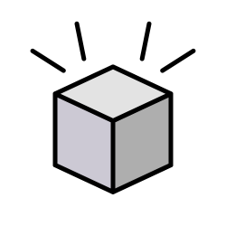
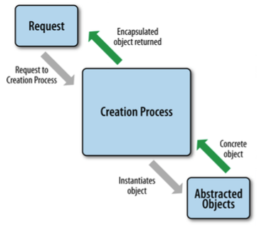
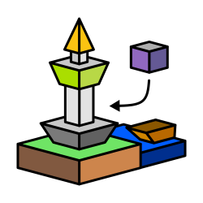
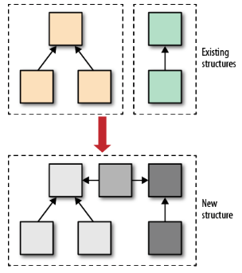
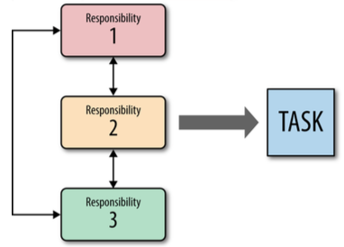

# Oh-My-Patt! - Design Patterns

> The series of design patterns in COMP6122 - Framework Layer Architectures.

Hai teman-teman, selamat datang di laman GitHub Pages Framework Layer Architectures (FLA)! Kali ini saya kembali menuliskan ringkasan materi-materi FLA melalui Repository, Wiki, dan GitHub Pages dengan **100% asli hasil pembelajaran saya**.

Oh iya, perkenalkan **"Oh-My-Patt!"**, brand laman Design Pattern berbahasa Indonesia dimana anda akan terjun ke dalam alam dunia Design Pattern dengan penyajian materi yang menarik & lengkap melalui project ini.

**Oh-My-Patt! Design Patterns** merupakan Repository, Wiki & GitHub Pages yang berisikan kumpulan design patterns dalam Framework Layer Architectures.

Materi Design Pattern ini sebagian diambil dari buku "Design Patterns: Elements of Reusable Object-Oriented Software" alias _**Gang of Four Design Patterns**_ yang ditulis oleh Erich Gamma, Richard Helm, Ralph Johnson, and John Vlissides.

Design Pattern terbagi menjadi 3 bagian:

1. [Creational Design Patterns](Creational)
2. [Structural Design Patterns](Structural)
3. [Behavioral Design Patterns](Behavioral)

## Creational Design Patterns

[Klik di sini untuk pembahasan Creational Design Patterns](Creational)

Merupakan design pattern yang berperan dalam pembuatan object maupun deklarasi object untuk mempermudah pemakaian kembali code dan meningkatkan fleksibilitas dalam hierarki class.

Ada 5 jenis creational design patterns:

1. [Singleton](Creational/Singleton)
2. [Factory Method](Creational/Factory-Method)
3. [Abstract Method](Creational/Abstract-Method)
4. [Builder](Creational/Builder)
5. [Prototype](Creational/Prototype)

## Structural Design Patterns

[Klik di sini untuk pembahasan Structural Design Patterns](Structural)

Merupakan design pattern yang berperan dalam strukturisasi object untuk memudahkan skalabilitas _(scalability)_ dengan menjamin fleksibilitas dan efisiensi dari class itu sendiri.

Ada 7 jenis structual design patterns:

1. [Adapter](Structural/Adapter)
2. [Bridge](Structural/Bridge)
3. [Composite](Structural/Composite)
4. [Decorator](Structural/Decorator)
5. [Facade](Structural/Facade)
6. [Flyweight](Structural/Flyweight)
7. [Proxy](Structural/Proxy)

## Behavioral Design Patterns

Merupakan design pattern yang melibatkan fungsionalitas dalam suatu class baik pemakaian algoritma maupun relasi antar class/object.

Ada 10 jenis behavioral design patterns:

1. [Chain of Responsibility](Behavioral/Chain-of-Responsibility)
2. [Command](Behavioral/Command)
3. [Iterator](Behavioral/Iterator)
4. [Mediator](Behavioral/Mediator)
5. [Memento](Behavioral/Memento)
6. [Observer](Behavioral/Observer)
7. [State](Behavioral/State)
8. [Strategy](Behavioral/Strategy)
9. [Template Method](Behavioral/Template-Method)
10. [Visitor](Behavioral/Visitor)

## Catatan ringan

Kalian juga bisa **Bookmark, beri Bintang/Star, Fork, buat Issue/Pull Request, maupun berkontribusi** ke [project ini](https://github.com/akmalrusli363/fla-design-patterns) karena saya akan melakukan update secara rutin pada Repository, Wiki, dan GitHub Pages mengenai Design Pattern selama proses pembelajaran saya ya! :wink: 

## Referensi

Kalian dapat menyimak materi yang telah dibahas pada laman ini dengan membaca kembali sumber referensi yang ada (baik sumber utama maupun sumber-sumber tambahan dari topik tertentu) untuk menambah wawasan tambahan anda mengenai dunia design pattern.

- Erich Gamma, Richard Helm, Ralph Johnson, and John Vlissides. Design Patterns: Elements of Reusable Object-Oriented Software. Addison-Wesley Professional, 1994.
- Refactoring.guru - [https://refactoring.guru/design-patterns/catalog](https://refactoring.guru/design-patterns/catalog)
- Sourcemaking.com - [https://sourcemaking.com/design_patterns](https://sourcemaking.com/design_patterns)
- Gang Of Four (GoF) Design Patterns - [https://www.journaldev.com/31902/gangs-of-four-gof-design-patterns](https://www.journaldev.com/31902/gangs-of-four-gof-design-patterns)

Penting untuk kalian ketahui bahwa dua sumber online utama, **Refactoring.guru** dan **Sourcemaking.com**, menyajikan cara implementasi dan pembahasan yang berbeda. Oleh sebabnya, ada baiknya bagi anda untuk membaca kedua sumber tersebut untuk menjamin bahwa konsep yang diterapkan benar-benar sesuai konsep dan pemahaman.
