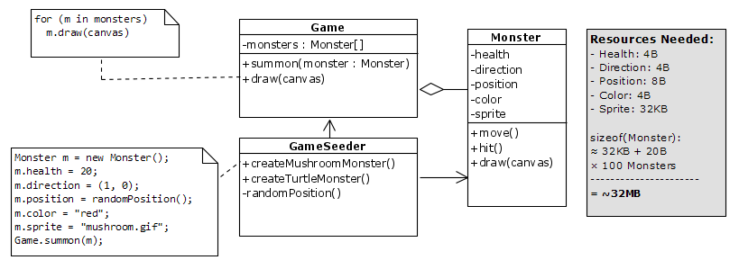
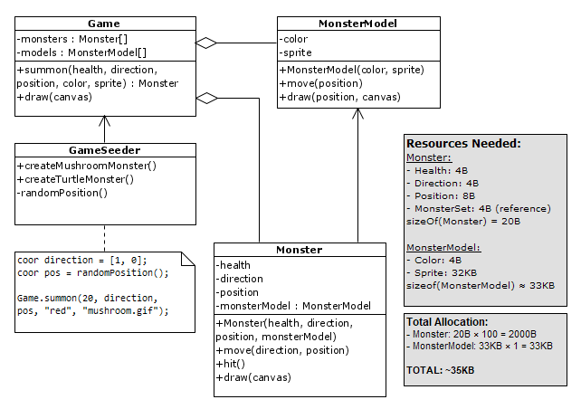

# Flyweight

[Main Page](..) → [Structural Patterns](.) → [Flyweight](#)

[refactoring.guru](https://refactoring.guru/design-patterns/flyweight) | [sourcemaking.com](https://sourcemaking.com/design_patterns/flyweight)


**Flyweight** merupakan design pattern yang bertujuan untuk menghemat resources dengan berbagi komponen/data penting antar object dibanding dengan menampung seluruh data secara individual dalam masing-masing object. Pada definisi yang berbeda, **flyweight** digunakan untuk menurunkan beban pada masing-masing object dengan menggantikan komponen dengan resource yang berat dengan resource yang lebih ringan dan irit.

**Flyweight** sendiri sering digunakan dalam web browser dan game dimana object-object yang dibuat/diload dalam browser maupun game dioptimalisasikan agar tidak membebani resource yang ditampung dalam memory.

Pada kasus web browser, object-object yang sudah dimuatkan akan ditampung sebagai cache dimana ketika browser melakukan *refresh* pada laman yang sama maka object-object tersebut tinggal dimuatkan dari cache tanpa harus mendownload object tersebut dari server.

Pada kasus object-object dalam game (misalnya partikel), object didistribusikan menjadi 2 jenis, *entity* dan *model* dimana *entity* merepresentasikan atribut-atribut penting yang unik dan berbeda dan *model* yang merepresentasikan atribut-atribut yang sama modelnya dan berulang.


## UML Model


## Essences of Flyweight

### 1. Flyweight (Shared components/intrinsic state)

Untuk pembagian komponen untuk keperluan optimalisasi, biasanya terdapat beberapa attribute yang akan saling berbagi dengan object-object lain. Sebagai solusinya, **flyweight** (intrinsic/shared state) merupakan attribute yang nilainya sama dan saling berbagi komponen satu sama lain.

Contoh termudahnya adalah model monster (sprite, shape, dan variasinya) dimana model monster tersebut hampir selalu sama pada setiap monster yang dibuat.

```java
// template
public class Flyweight {
    private final Object repeatingState;

    public Flyweight(Object repeatingState) {
        this.repeatingState = repeatingState;
    }

    public void method(Object uniqueState) {
        // do something
    }
}
```

```java
// example
public class MonsterModel {
    private final String sprite;
    private final String color;

    public MonsterModel(String sprite, String color) {
        this.sprite = sprite;
        this.color = color;
    }

    public String getSprite() {
        return sprite;
    }

    public String getColor() {
        return color;
    }

    public boolean equals(String sprite, String color) {
        return this.sprite.equals(sprite) && this.color.equals(color);
    }

    public void draw(Canvas canvas, Point position) {
        Image img = new Image(sprite);
        canvas.put(image, color, position);
    }
}
```

Karena flyweight bersifat **immutable/read-only**, maka nilai-nilai yang ada pada MonsterModel tidak boleh diubah dan hanya boleh di-set saat dideklarasikan melalui constructor.


### 2. Context (Unshared components/extrinsic state)

**Context** (Unshared/extrinsic state) adalah attribute-attribute yang nilainya beda (alias unik) pada setiap objectnya. Context mencakup *unique attributes* dan *shared components/flyweight* yang merepresentasikan 1 object utuh.

Contohnya adalah health, movement, position. Jika digabungkan dengan *flyweight objects* (seperti model), maka object pada context dapat merepresentasikan sebuah object monster secara utuh.

```java
// template
public class Context {
    private Object uniqueState;
    private Flyweight flyweight;

    public Flyweight(Object repeatingState, Object uniqueState) {
        flyweight = FlyweightFactory.getFlyweight(repeatingState);
        this.uniqueState = uniqueState;
    }

    public void method() {
        flyweight.method(uniqueState);
    }
}
```

```java
// example
public class Monster {
    private MonsterModel model;
    private int health;
    private Point position;

    public MonsterModel(String sprite, String color, int health, Point position) {
        MonsterModelFactory.getModel(sprite, color);
        this.health = health;
        this.position = position;
    }

    public String getHealth() {
        return model.getHealth();
    }

    public String getPosition() {
        return model.getPosition();
    }

    public MonsterModel getModel() {
        return model;
    }

    public void draw(Canvas canvas) {
        model.draw(canvas, position)
    }
}
```

### 3. Factory (Component Pool)

Terdiri dari sekumpulan *shared components* dan *unshared components*. Proses validasinya akan dilakukan pada class ini dimana nantinya pool ini yang akan menentukan apakah object tersebut perlu dibuat komponen pembaginya atau berbagi dengan *shared componenets* yang sudah ada.

```java
// template, better with singleton
public class FlyweightFactory {
    private static FlyweightFactory instance;
    private ArrayList<Flyweight> flyweights;

    public static FlyweightFactory getInstance() {
        if (instance == null) {
            instance = new FlyweightFactory();
        }
        return instance;
    }

    private FlyweightFactory() {
        flyweights = new ArrayList<>();
    }

    public Flyweight getFlyweight(Object repeatingState) {
        for (Flyweight f : flyweights) {
            if (f.getRepeatingState().equals(repeatingState)) {
                return f;
            }
        }
        Flyweight newObject = new Flyweight(repeatingState);
        flyweights.add(newObject);
        return newObject;
    }
}
```

```java
// example
public class MonsterModelFactory {
    private static MonsterModelFactory instance;
    private ArrayList<MonsterModel> models;

    public static MonsterModelFactory getInstance() {
        if (instance == null) {
            instance = new MonsterModelFactory();
        }
        return instance;
    }

    private MonsterModelFactory() {
        models = new ArrayList<>();
    }

    public MonsterModel getFlyweight(String sprite, String color) {
        for (MonsterModel model : models) {
            if (model.equals(sprite, color)) {
                return model;
            }
        }
        MonsterModel newModel = new MonsterModel(sprite, color);
        models.add(newModel);
        return newModel;
    }
}
```


## Contoh kasus

### A. Web Browser

Ada banyak cara dari browser untuk menghemat resource yang dibebankan pada pemakainya, salah satunya adalah caching. Caching sering diaplikasikan pada konten web (baik isi HTML maupun gambar didalamnya) dimana browser akan menyimpan konten-konten yang dimuatnya ke dalam cache. Ketika laman tersebut diperbarui, maka komponen tersebut akan menggunakan gambar yang tersimpan sebelumnya sebagai gambarnya dengan mencocokkan gambar yang akan dimuat dengan gambar yang tersedia dalam cache.


### B. Game Object

Pada kasus game sendiri terdapat object yang memiliki beberapa attribute penting (misalnya model, posisi, status, gerakan, dan arah). Ketika object tersebut dideklarasikan sebagai satu kesatuan, maka seluruh attribute (termasuk modelnya) ikut serta dalam pembuatan dan rendering object.

Ketika object yang sama (misalnya monster jamur) digambarkan sebanyak 100 monster, maka resource yang dibutuhkan sangat amat banyak. Kita dapat asumsikan bahwa setiap monster memiliki attribute sebagai berikut:

- Health (4 bit, value between 0-10)
- Direction (coordinate, value between -1 to 1)
- Position (coordinate, signed integer value)
- Color (16 colors)
- Sprite (load from file, max 32KB)

Maka ketika monster tersebut perlu digambar sebanyak 100x, akan memakan resource yang sangat banyak dengan kalkulasi data sebagai berikut:

| Attribute |        Size | Rendered size (x100) |
| --------- | ----------: | -------------------: |
| Health    |          4B |                 400B |
| Direction | 2 * 2B = 4B |                 400B |
| Position  | 2 * 4B = 8B |                 800B |
| Color     |          4B |                 400B |
| Sprite    |        32KB |               3200KB |
| *Total*   |       ~33KB |              ~3202KB |

Atau bila dalam diagram UML:



Untuk meringankan beban yang dibutuhkan apalagi harus menggambar ratusan object sekaligus, maka atribut-atribut yang sering & selalu digambar berulang-ulang dipisahkan (extract) sebagai class baru dimana object yang dibuat pada class tersebut bersifat immutable (alias tidak dapat diubah bantuknya)

Pada kasus monster, atribut-atribut yang diekstrak sebagai class baru adalah **color** dan **sprite** dimana kedua attribute tersebut selalu digambar dari model dan warna yang sama. Karena selalu sama modelnya dan dibuat berkali-kali, maka object tersebut diekstrak sebagai kelas tersendiri yaitu `MonsterModel`.

| Monster Attribute |        Size | Pool size (x100) |
| ----------------- | ----------: | ---------------: |
| Health            |          4B |             400B |
| Direction         | 2 * 2B = 4B |             400B |
| Position          | 2 * 4B = 8B |             800B |
| Model             |          4B |             400B |
| *Monster Total*   |         20B |             ~2KB |

[]()

| Model Attribute |  Size | Rendered size (x1) |
| --------------- | ----: | -----------------: |
| Color           |    4B |                 4B |
| Sprite          |  32KB |               32KB |
| *Model Total*   | ~33KB |              ~33KB |

[]()

| Attribute               | Size | Weight | Total Rendered size (x100) |
| ----------------------- | ---: | -----: | -------------------------: |
| Monster (include Model) |  20B |    100 |                       ~2KB |
| Model                   | 32KB |      1 |                       32KB |
| *Total*                 |      |        |                      ~34KB |

Atau representasi diagram UML-nya:



Agar model object tersebut tidak perlu digambar berulang kali, maka kedua attribute tersebut harus dimasukkan ke dalam method `summon()` dengan melakukan pencocokan terhadap model-model monster yang telah ada terlebih dahulu.

Jika model tersebut merupakan model baru dan belum ada pada monster-monster sebelumnya maka akan dibuatkan object `MonsterModel`. Sebaliknya jika ada, maka model yang digunakan pada monster sebelumnya langsung akan dipakai sebagai modelnya.

Atau secara code, untuk membuatkan object Monster, class `Game` akan mencarikan model-model yang tersedia dalam `MonsterModel[]` untuk dicocokan dengan pembuatan object dalam method `summon()` dengan implementasi sebagai berikut:

```java
public class Game {
    private ArrayList<Monster> monsters;
    private ArrayList<MonsterModel> models;

    public Monster summon(int health, Point direction, Point position, String color, String sprite) {
        MonsterModel model = getMonsterModel(color, sprite);
        if (model == null) {
            model = new MonsterModel(color, sprite);
            models.add(model);
        }
        return new Monster(health, direction, position, model);
    }

    private MonsterModel getMonsterModel(String color, String sprite) {
        for (MonsterModel model : models) {
            if (model.getSpriteUrl().equals(sprite) && model.getColor().equals(color)) {
                return model;
            }
        } return null;
    }

    public void draw(Canvas canvas) {
        for (Monster m : monsters) {
            m.draw(canvas);
        }
    }
}
```

## References

- Erich Gamma, Richard Helm, Ralph Johnson, and John Vlissides. Design Patterns: Elements of Reusable Object-Oriented Software. Addison-Wesley Professional, 1994. Page 218-232.
- Eric Freeman, Elisabeth Robson, Bert Bates, Kathy Sierra. Head First Design Patterns. O'Reilly Media, 2004. ISBN: 9780596007126. Page 618-619.
- Refactoring.guru (Flyweight, termasuk referensi gambar) - [https://refactoring.guru/design-patterns/flyweight](https://refactoring.guru/design-patterns/flyweight)
- SourceMaking (Flyweight, termasuk referensi gambar) - [https://sourcemaking.com/design_patterns/flyweight](https://sourcemaking.com/design_patterns/flyweight)
- Gang Of Four (GoF) Design Patterns: Flyweight - [https://www.journaldev.com/1562/flyweight-design-pattern-java](https://www.journaldev.com/1562/flyweight-design-pattern-java)
- Wikipedia English: Flyweight Pattern - [https://en.wikipedia.org/wiki/Flyweight_pattern](https://en.wikipedia.org/wiki/Flyweight_pattern)