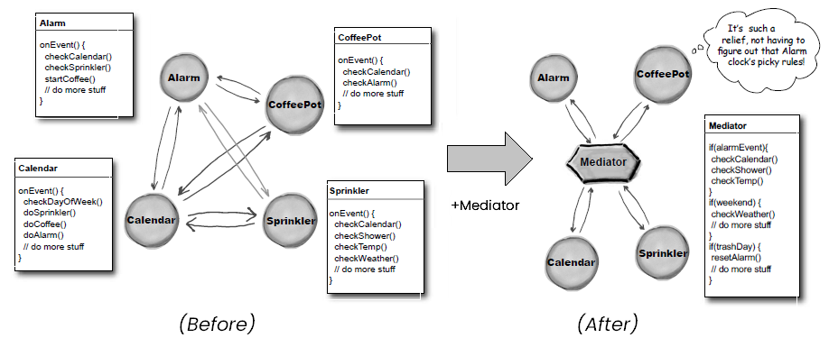
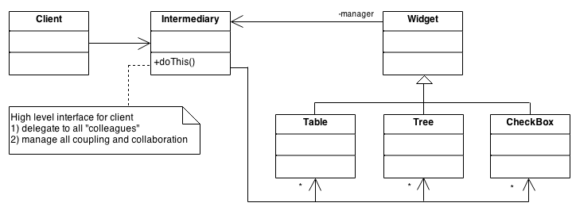
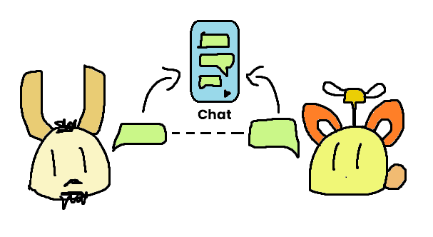

# Mediator

[refactoring.guru](https://refactoring.guru/design-patterns/mediator) | [sourcemaking.com](https://sourcemaking.com/design_patterns/mediator)


**Mediator** merupakan design pattern yang berperan sebagai penengah antara 2 atau lebih komponen/object class yang berbeda. Ketika object-object ingin berkomunikasi satu sama lain, maka Mediator akan menerima dan mengirimkan informasi dari satu object class ke object class lainnya.

Fungsi dari Mediator adalah untuk meminimalisir komunikasi antar object dengan menggunakan class penengah *(Mediator/Intermediary/Controller)* dimana class tersebut akan menjadi pusat komunikasi antar object. Nantinya class-class yang terhubung oleh Mediator dapat berkomunikasi satu sama lain dengan bantuan Mediator sehingga dapat mengurangi tingkat *coupling* antar kedua class.

Mediator memiliki hubungan antar object yang *many-to-many* bila dibandingkan dengan **_mediator_** design pattern yang hanya bersifat *one-to-many* antara Subject/Observable dan mediator/Subscriber. Oleh karenanya, Mediator lebih sering digunakan sebagai sarana *communicator* (komunikasi dua arah, _bi-directional_) dibanding sebagai sarana *subscription* (komunikasi satu arah, _unidirectional_).


## Analogi


Pernahkah kalian menggunakan Controller ketika anda sedang mengerjakan project-project berbasis *MVC (Model-View-Controller)*? Penggunaan Controller sendiri adalah salah satu bentuk bagaimana komunikasi antar elemen dalam class dipusatkan pada 1 class khusus yaitu **_Controller/Mediator_**.

Begitu juga ketika anda sedang merancang aplikasi berbasis User Interface yang menggunakan mediator sebagai penengah antar object-objectnya dimana sebuah view/UI class (sebagai pusat komunikasi antar object dipersatukan) seharusnya berkomunikasi secara terpusat melaluinya. Elemen-elemen view apapun (baik button, dropdown, text field, maupun tab) harus dipusatkan melalui 1 class pusat yang dikenal sebagai **Mediator**.


Hal ini bertujuan agar segala tatanan yang dijalankan pada elemen-elemen view dapat terkoordinasi dengan baik, terutama bila anda ingin melakukan validasi pada setiap elemen view untuk kebutuhan registrasi/login/dll. Tanpa adanya pemusatan komunikasi melalui sebuah mediator, komunikasi antar *view element* bakalan kacau karena dependensi antar object yang saling terikat satu sama lain karena tingkat *coupling* yang sangat tinggi.


Hal ini juga berlaku demikian pada kasus di dunia penerbangan dimana setiap pesawat dan helikopter yang berada dalam lalu lintas udara harus berkomunikasi dengan pihak *Air Traffic Control (ATC)* untuk melaporkan lokasi dan kondisi penerbangan terutama ketika ia ingin melakukan pendaratan maupun yang akan lepas landas dari landasan pacu. Penggunaan *Air Traffic Control (ATC)* dalam dunia penerbangan bertujuan agar para penerbang (pilot) dapat menjalankan tugas penerbangan secara terkoordinir tanpa mengakibatkan gangguan maupun miskomunikasi akibat adanya pesawat yang ingin melakukan lepas landas maupun melakukan pendaratan (secara normal maupun darurat) serta pilot dapat memahami secara pasti mengenai kondisi di sekitar landasan pacu (termasuk bandara/pangkalan penerbangan).

### Analogi Extra: Smart Home

Masih belum paham mengenai konsep mediator? Anda juga bisa menyimak contoh konsep dari *Head First Design Pattern* dimana dalam sebuah kisah terdapat rancangan sistem *smart home* dimana pada awal mulanya terdapat 4 object yang saling berkomunikasi satu sama lain.



Komunikasi antar keempat object tersebut tentunya akan semakin sulit dan rumit apabila salah satu classnya diubah isinya ataupun terdapat tambahan class baru yang tentunya sangat mempersulit keberadaan class lainnya karena class lain akan ikut terpengaruh terhadap perubahan yang terjadi pada salah satu classnya.

Sebagai solusinya, Mediator digunakan untuk memfasilitasi berbagai kebutuhan dan validasi yang dibutuhkan oleh masing-masing komponen agar tingkat dependensi dan *coupling* berkurang serta dapat memaksimalkan *object reusability* terhadap setiap komponen.


## Essences of Mediator

### 1. Mediator

**Mediator** digunakan sebagai penengah dan pusat komunikasi antar beberapa object. Dalam class mediator berisikan *array/list* yang berisikan beberapa object didalamnya.

Mediator berperan sebagai pusat komunikasi antar beberapa object dimana nantinya setiap komunikasi dari object-object luar akan diterima olehnya dan akan diproses apabila diperlukan oleh object tersebut untuk diinformasikan ke object lain atau mediator akan menjalankan perintahnya atas *event* yang diterima.

Dalam Mediator juga terdapat tampungan untuk menyimpan komponen-komponen *(alias Colleague)* ke dalam *list/array* dan/atau sebagai *references* terhadap object class lain bila object tersebut ingin menjalin hubungan ke object lain.

Model utama dari sebuah Mediator class adalah adanya interaksi antar beberapa komponen/object class dan terdapat tampungan untuk menerima component-component yang akan saling berkomunikasi satu sama lain.

Contoh code:

```java
// An interface or abstract class isn't always required to define mediator
public interface Mediator {
  void addMember(Component component);
  void removeMember(Component component);

  /**
   * This is the methods to mediate between class objects.
   * You can add more for managing coupling and collaboration between
   * class objects. Or you can delegate to "colleagues" for communication.
   */
  void listen(Component source, Component to, String message);
}

public class TrafficMediator {
  private ArrayList<Component> components;

  public TrafficMediator() {
    components = new ArrayList<>();
  }

  @Override
  public void addMember(Component component) {
    components.add(component);
  }

  @Override
  public void removeMember(Component component) {
    components.remove(component);
  }

  @Override
  public void listen(Component source, Component to, String message) {
    if (to != null) {
      to.receiveSignal(source, message);
    } else {
      for (Component component : components) {
        if (component != source) {
          component.receiveSignal(source, message);
        }
      }
    }
  }
}

```

> Eh.. jangan sampai kebablasan bikin mediator menjadi *"(super) controller"* apalagi jadi *god class*! Meski bisa digandengkan dengan **_Facade_** untuk meminimalkan dan menyamarkan interaksi langsung antar object class, tapi bukan berarti semua komunikasi menjadi sangat *otoriter* terhadap mediator ya :cop:

### 2. Components/Colleague

**Komponen-komponen** yang akan menjalin hubungan komunikasi bisa berupa model apapun (tidak terbatas hanya sekedar mengirimkan informasi), dengan syarat bahwa komponen tersebut **sudah menyertakan Mediator dalam komponen** tersebut sehingga ketika komponen tersebut ingin dideklarasikan ke class lain maka deklarasi komponen tersebut tinggal dihubungkan kepada mediator lainnya.

Mudahnya, ketika component tersebut ingin dipasangkan dengan Mediator, tinggal menambahkan object `Mediator` dalam component classnya sebagai berikut:

```java
public class MyComponent {
  private Mediator mediator;

  public MyComponent(Mediator mediator) {
    this.mediator = mediator;
    mediator.addMember(this);
  }
}
```

Atau bila ingin diberi aplikasi/penerapan tambahan seperti pada contoh code sebagai berikut:

```java
public class MyComponent {
  private Mediator mediator;
  private String name = "An communicator";

  public MyComponent(Mediator mediator) {
    this.mediator = mediator;
    mediator.addMember(this);
  }

  public MyComponent(String name, Mediator mediator) {
    this(mediator);
    this.name = name;
  }

  public void sendMessage(MyComponent to, String message) {
    mediator.listen(this, to, message);
  }

  public void receiveSignal(MyComponent from, Stirng message) {
    System.out.printf("Received from %s: %s\n", from.toString(), message);
  }

  public void setName(String name) {
    this.name = name;
  }

  public String getName() {
    return name;
  }

  public String toString() {
    return getName();
  }
}
```

## UML Model




## Contoh Kasus



Salah satu contoh penerapan **mediator design pattern** adalah sarana komunikasi melalui chat dimana orang-orang akan saling berkomunikasi sama lain dengan menggunakan layanan instant messaging. Ketika seseorang ingin mengirimkan pesan ke orang lain, maka orang lain akan menerima pesan dari orang yang dikirimkan. Dalam beberapa kasus tertentu, ketika orang ingin mengirimkan pesan kepada orang-orang dalam grup tertentu, perlu ada penambahan code yang tentunya mengakibatkan sebuah class (user/chat member) sering mengalami modifikasi yang berkali-kali sehingga melanggar *Open/Closed Principle (OCP)*.

Sebagai gantinya, agar dapat memaksimalkan komunikasi antar pengguna melalui chat, kita dapat menggunakan **Mediator** dengan menampung user-user dan memusatkan komunikasi lintas pengguna dengan method-method yang akan mengkoordinasikan user-user lain agar tidak menambah beban kepada class user.

### Implementasi Code

Pertama-tama, buatlah class chat member (misalnya `Employee` yang berisikan karyawan sebagai chat member):

```java
public abstract class Employee {
  private String name;
  protected String role;
  protected MessageMediator mediator;

  public Employee(String name, MessageMediator mediator) {
    this.name = name;
    this.mediator = mediator;
    mediator.addEmployee(this);
  }

  public void sendMessage(String message, Employee to, String division) {
    mediator.sendMessage(message, this, to, division);
  }

  public void receiveMessage(String message, Employee from) {
    System.out.printf("%s sends message to %s: %s\n", from.toString(), this.toString(), message);
  }

  public String getName() {
    return name;
  }

  public void setName(String name) {
    this.name = name;
  }

  public String getRole() {
    return role;
  }

  public void setRole(String role) {
    this.role = role;
  }

  @Override
  public String toString() {
    return String.format("[%s - %s]", getName(), getRole());
  }
}
```

Kemudian buatlah class implementasinya sebagai berikut (misalnya terdapat 3 divisi karyawan yaitu `Research`, `DatabaseAdmin`, dan `Programmer`):

```java
public class Research extends Employee {
  public Research(String name, MessageMediator mediator) {
    super(name, mediator);
    this.role = "Research";
  }
}

public class DatabaseAdmin extends Employee {
  public DatabaseAdmin(String name, MessageMediator mediator) {
    super(name, mediator);
    this.role = "Database Admin";
  }
}

public class Programmer extends Employee {
  public Programmer(String name, MessageMediator mediator) {
    super(name, mediator);
    this.role = "Programmer";
  }
}
```

Pada basis dasar, ketika user ingin berkomunikasi dengan user lain, maka user lain akan menerima pesan dari user pengirim. Sebaliknya, ketika user ingin berkomunikasi dengan semua user dalam chat room/group, maka user tersebut perlu mengambil semua user dalam chat room tersebut sehingga perlu pengubahan code dalam class chat user itu sendiri.

Solusinya adalah dengan menambahkan mediator ke dalam chat, dimana dalam kasus berikut terdapat interface `MessageMediator` dan concrete class `ChatMediator` yang bertujuan untuk memusatkan komunikasi antar chat member. Segala bentuk komunikasi yang akan dilakukan oleh user/chat member dipusatkan dalam class `ChatMediator` dimana segala pesan yang dikirimkan dari user akan diproses dan divalidasikan sebelum diterima oleh user-user lain yang bersangkutan.

Pertama-tama, buatlah interface `MessageMediator` terlebih dahulu seperti pada di bawah:

```java
public interface MessageMediator {
  public void sendMessage(String message, Employee from, Employee to, String division);
  public void addEmployee(Employee employee);
  public void removeEmployee(Employee employee);
}
```

Dalam interface tersebut tersedia method untuk menambahkan user dimana nantinya ketika user (alias chat member) dideklarasikan, maka object tersebut otomatis ditambahkan ke dalam list pada `MessageMediator`.

Selanjutnya, buatlah class `ChatMediator` dengan mengimplementasikan class `MessageMediator` dimana nantinya segala bentuk komunikasi yang dilakukan para chat member dipusatkan pada `ChatMediator`. Dalam class `ChatMediator`, akan ada method `sendMessage()` yang akan menerima delegasi dari user pengirim yang berisikan pesan untuk dikirimkan pada penerima maupun user-user dalam divisi tersebut.

```java
public class ChatMediator implements MessageMediator {
  private ArrayList<Employee> employeeList;

  public ChatMediator() {
    employeeList = new ArrayList<>();
  }

  @Override
  public void sendMessage(String message, Employee from, Employee to, String division) {
    if (to != null) {
      to.receiveMessage(message, from);
    } else {
      for (Employee employee : employeeList) {
        if (division == null && employee != from) {
          employee.receiveMessage(message, from);
        } else if (employee.getRole().equals(division) && employee != from) {
          employee.receiveMessage(message, from);
        }
      }
    }
  }

  @Override
  public void addEmployee(Employee employee) {
    employeeList.add(employee);
  }

  @Override
  public void removeEmployee(Employee employee) {
    employeeList.remove(employee);
  }
}
```

Dalam method `sendMessage()`, berisikan validasi dimana nantinya akan dicek apakah terdapat user yang akan dikirimkan dari user pengirim atau dikirimkan kepada seluruh user maupun user dalam konteks tertentu (misal semua karyawan yang terdaftar atau karyawan dalam divisi tertentu). Jika proses tersebut telah memenuhi validasi, nantinya pesan akan diterima kepada penerima yang dituju oleh user.

Pada sebuah skeneario, misalnya terdapat 3 divisi dalam sebuah perusahaan yang saling berdiskusi satu sama lain, yaitu Research, Database Administratior, dan Programmer. Dalam satu chat group terdapat paling tidak 6 karyawan yang saling berdiskusi satu sama lain. Pembahasan keenam karyawan ini dijabarkan dalam contoh code di bawah:

```java
MessageMediator mediator = new ChatMediator();

Employee andreas = new Research("Andreas", mediator);
Employee johan = new Research("Johan", mediator);
Employee supri = new DatabaseAdmin("Supri", mediator);
Employee william = new DatabaseAdmin("William", mediator);
Employee indra = new Programmer("Indra", mediator);

// isi chat
andreas.sendMessage("Guys.. ku butuh data penting mengenai data mahasiswa kita..!", null, null);
supri.sendMessage("Ya temans, lagi ku cari data-data mahasiswa kita nih", andreas, "Research");
indra.sendMessage("Ya nih, biar mahasiswa bisa cek absensi secara mandiri nih :D", null, "Research");
william.sendMessage("Oh iya, database kita harusnya aman kan?", supri, "Database Admin");
supri.sendMessage("Aman kok :)", william, "Database Admin");
william.sendMessage("Programmer kuliku, kami akan usahakan semaksimal mungkin", null, "Programmer");
johan.sendMessage("Udah dapat belum dari databasenya?", null, "Database Admin");
supri.sendMessage("Sudah sobat, akan ku bagikan ke kalian semua kok", johan, "Research");
andreas.sendMessage("Oke siap sobatku :D", null, "Database Admin");
```

Maka outputnya adalah sebagai berikut:

```
[Andreas - Research] sends message to [Johan - Research]: Guys.. ku butuh data penting mengenai data mahasiswa kita..!
[Andreas - Research] sends message to [Supri - Database Admin]: Guys.. ku butuh data penting mengenai data mahasiswa kita..!
[Andreas - Research] sends message to [William - Database Admin]: Guys.. ku butuh data penting mengenai data mahasiswa kita..!
[Andreas - Research] sends message to [Indra - Programmer]: Guys.. ku butuh data penting mengenai data mahasiswa kita..!
[Supri - Database Admin] sends message to [Andreas - Research]: Ya temans, lagi ku cari data-data mahasiswa kita nih
[Indra - Programmer] sends message to [Andreas - Research]: Ya nih, biar mahasiswa bisa cek absensi secara mandiri nih :D
[Indra - Programmer] sends message to [Johan - Research]: Ya nih, biar mahasiswa bisa cek absensi secara mandiri nih :D
[William - Database Admin] sends message to [Supri - Database Admin]: Oh iya, database kita harusnya aman kan?
[Supri - Database Admin] sends message to [William - Database Admin]: Aman kok :)
[William - Database Admin] sends message to [Indra - Programmer]: Programmer kuliku, kami akan usahakan semaksimal mungkin
[Johan - Research] sends message to [Supri - Database Admin]: Udah dapat belum dari databasenya?
[Johan - Research] sends message to [William - Database Admin]: Udah dapat belum dari databasenya?
[Supri - Database Admin] sends message to [Johan - Research]: Sudah sobat, akan ku bagikan ke kalian semua kok
[Andreas - Research] sends message to [Supri - Database Admin]: Oke siap sobatku :D
[Andreas - Research] sends message to [William - Database Admin]: Oke siap sobatku :D
```

Untuk penjelasan super lengkapnya, dapat kalian simak codenya & jalankan demonya pada source code di atas.


## Referensi

- Erich Gamma, Richard Helm, Ralph Johnson, and John Vlissides. Design Patterns: Elements of Reusable Object-Oriented Software. Addison-Wesley Professional, 1994.
- Eric Freeman, Elisabeth Robson, Bert Bates, Kathy Sierra. Head First Design Patterns. O'Reilly Media, 2004. ISBN: 9780596007126.
- Refactoring.guru (Mediator, termasuk referensi gambar) - [https://refactoring.guru/design-patterns/mediator](https://refactoring.guru/design-patterns/mediator)
- SourceMaking (Mediator, termasuk referensi gambar) - [https://sourcemaking.com/design_patterns/mediator](https://sourcemaking.com/design_patterns/mediator)
- Gang Of Four (GoF) Design Patterns: Mediator - [https://www.journaldev.com/1730/mediator-design-pattern-java](https://www.journaldev.com/1730/mediator-design-pattern-java)