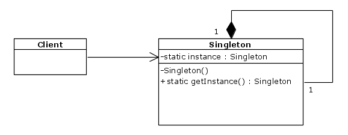
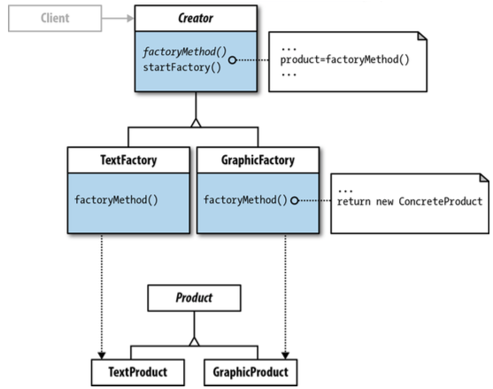
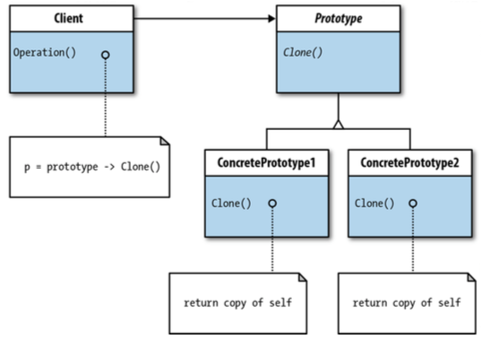
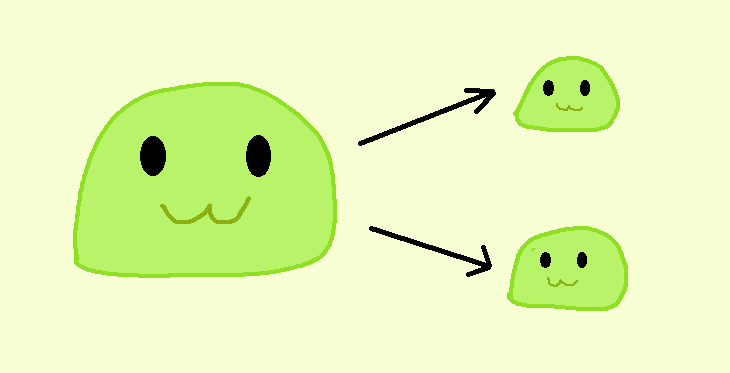

# Creational Patterns

<p align="center" style="text-align:center"></p>

<p align="center" style="text-align:center"></p>

Merupakan design pattern yang berperan dalam pembuatan object maupun deklarasi object untuk mempermudah pemakaian kembali code dan meningkatkan fleksibilitas dalam hierarki class.

Ada 5 jenis creational patterns:

1.  [Singleton](#Singleton)
2.  [Factory Method](#Factory-Method)
3.  [Abstract Method](#Abstract-Method)
4.  [Builder](#Builder)
5.  [Prototype](#Prototype)

## Singleton

[Penjelasan & Source code](singleton) | [refactoring.guru](https://refactoring.guru/design-patterns/singleton) | [sourcemaking.com](https://sourcemaking.com/design_patterns/singleton)



> The most basic & simplest type of creational design pattern. Just define a private constructor & call for a instance to define a object.

Singleton merupakan design pattern yang paling sederhana yang bertujuan untuk membatasi deklarasi menjadi hanya 1 instance/object dalam sebuah class. Dalam Singleton, hanya ada 1 object dari class tersebut yang dapat dibuat untuk class client, yaitu _instance_ itu sendiri. Setiap pemanggilan object berikutnya yang dilakukan oleh client, object akan dipanggilkan langsung dari instance yang sudah dibuatkan oleh class tersebut.

Sederhananya, client tidak bisa membuat object dari suatu class lebih dari 1 kali, sebaliknya object tersebut kemudian memanggil instance/object pertama sudah dibuatkan oleh class tersebut.

Contoh code:

```java
public class Storage {
  private Storage() {}

  /**
   * An instance for Storage, initially to be null before client class invoke to define this object for first time!
   * For next declarations, it will return this object defined from this class since first declaration.
   */
  private volatile static Storage instance = null;

  public synchronized static Storage getInstance() {
    if (instance == null)
       instance = new Storage();
    return instance;
  }

  // beyond methods and declaration codes inside...

}
```

Atau jika disederhanakan:

```java
public class MySingleton {
  private MySingleton() {
    // TODO contents of constructor (if needed)
  }

  private volatile static MySingleton instance = null;

  public synchronized static MySingleton getInstance() {
    if (instance == null) {
      instance = new MySingleton();
    }
    return instance;
  }

  // TODO declaration and methods here...
}
```

## Factory Method

[Penjelasan & Source code](factorymethod) | [refactoring.guru](https://refactoring.guru/design-patterns/factory-method) | [sourcemaking.com](https://sourcemaking.com/design_patterns/factory_method)



Factory method menggunakan **satu abstract method** yang merepresentasikan 1 jenis class untuk memanggil/mendeklarasikan object class yang dilakukan oleh subclass dengan variasi object yang berbeda-beda (misal `SmartphoneFactory` menggunakan `createSmartphone()` untuk bikin Smartphone. Variasi-variasi yang dilakukan oleh factory terbatas pada 1 object class saja, yaitu Smartphone).

Contoh code:

```java
public abstract class Smartphone {
  private float screenSize;
  private int capacity;
  private String deviceType;

  public Smartphone() {
    assemble();
  }

  public abstract void assemble();

  public abstract String describe();

  public float getScreenSize() {
    return screenSize;
  }

  public void setScreenSize(float screenSize) {
    this.screenSize = screenSize;
  }

  public int getCapacity() {
    return capacity;
  }

  public void setCapacity(int capacity) {
    this.capacity = capacity;
  }

  public String getDeviceType() {
    return deviceType;
  }

  public void setDeviceType(String deviceType) {
    this.deviceType = deviceType;
  }

  @Override
  public String toString() {
    return String.format("%s (screen size: %.2f inch | capacity: %dGB | type: %s)",
        describe(), screenSize, capacity, deviceType);
  }
}

public class SimsongGalaxyPrime extends Smartphone {
  public void assemble() {
    setCapacity(64);
    setDeviceType("full-screen display");
    setScreenSize(5.99f);
    System.out.println("Assembling Simsong Galaxy Prime...");
  }

  public String describe() {
    return "Simsong Galaxy Prime";
  }
  // some codes...
}

public class SimsongGalaxyNote extends Smartphone {
  public void assemble() {
    setCapacity(128);
    setDeviceType("phablet");
    setScreenSize(6.6f);
    System.out.println("Assembling Simsong Galaxy Note...");
  }

  public String describe() {
    return "Simsong Galaxy Note";
  }
  // some codes...
}

public class SimsongFoldZ extends Smartphone {
  public void assemble() {
    setCapacity(512);
    setDeviceType("folded");
    setScreenSize(12.1f);
    System.out.println("Assembling Simsong Fold Z...");
  }

  public String describe() {
    return "Simsong Fold Z";
  }
  // some codes...
}
```

```java
public interface SmartphoneFactory {
  public Smartphone createSmartphone(String type);
}

public class SimsongFactory implements SmartphoneFactory {
  public Smartphone createSmartphone(String type){
    Smartphone smartphone = null;
    if (type.equals("Galaxy Prime")) {
      smartphone = new SimsongGalaxyPrime();
    } else if (type.equals("Galaxy Note")) {
      smartphone = new SimsongGalaxyNote();
    } else if (type.equals("Fold Z")) {
      smartphone = new SimsongFoldZ();
    }
    return smartphone;
  }
}
```


## Abstract Factory

[Penjelasan & Source code](abstractfactory) | [refactoring.guru](https://refactoring.guru/design-patterns/abstract-factory) | [sourcemaking.com](https://sourcemaking.com/design_patterns/abstract_factory)


Abstract Factory menggunakan **sekumpulan abstract method** yang merepresentasikan beberapa jenis class untuk mendeklarasikan object class yang dilakukan oleh subclass dengan variasi object yang berbeda-beda (misal `FurnitureFactory` dengan menggunakan 2 method `createSofa()` dan `createBed()` untuk bikin Furniture beserta turunan modelnya (sofa, lemari, meja, dll.)).

Contoh code:

```java
public interface Furniture {
  void assemble();
  String describe();

  @Override
  String toString();

  default String getFullDescription() {
    return toString();
  }
}

public abstract class Sofa implements Furniture {
  private String material;
  private int capacity;

  public Sofa() {
    assemble();
    System.out.println("Building sofa...");
  }

  public void setMaterial(String material) {
    this.material = material;
  }
  public void setCapacity(int capacity) {
    this.capacity = capacity;
  }
  public String getMaterial() {
    return material;
  }
  public int getCapacity() {
    return capacity;
  }
  
  @Override
  public String toString() {
    StringBuilder sb = new StringBuilder();
    sb.append(describe());
    sb.append("\nMaterial: ").append(getMaterial());
    sb.append("\nCapacity: ").append(getCapacity());
    return sb.toString();
  }
}

public abstract class Bed implements Furniture {
  private String cover, material;

  public Bed() {
    assemble();
    System.out.println("Building bed...");
  }

  public void setMaterial(String material) {
    this.material = material;
  }
  public void setCover(String cover) {
    this.cover = cover;
  }
  public String getMaterial() {
    return material;
  }
  public String getCover() {
    return cover;
  }
  
  @Override
  public String toString() {
    StringBuilder sb = new StringBuilder();
    sb.append(describe());
    sb.append("\nMaterial: ").append(getMaterial());
    sb.append("\nCover: ").append(getCover());
    return sb.toString();
  }
}
```

```java
public class VictorianSofa extends Sofa {
  public void assemble() {
    // assembling Victorian-styled sofa...
  }

  public String describe() {
    return "Victorian Sofa";
  }
}

public class VictorianBed extends Bed {
  public void assemble() {
    // assembling Victorian-styled bed...
  }

  public String describe() {
    return "Victorian Bed";
  }
}

public class MedievalSofa extends Sofa {
  public void assemble() {
    // assembling Medieval-styled sofa...
  }

  public String describe() {
    return "Medieval Sofa";
  }
}

public class MedievalBed extends Bed {
  public void assemble() {
    // assembling Medieval-styled bed...
  }

  public String describe() {
    return "Medieval Bed";
  }
}
// more furniture-derived style classes
```

```java
public interface FurnitureFactory {
  public Sofa createSofa();
  public Bed createBed();
}

public class VictorianFurnitureFactory implements FurnitureFactory {
  public Sofa createSofa() {
    return new VictorianSofa();
  }

  public Bed createBed() {
    return new VictorianBed();
  }
}

public class MedievalFurnitureFactory implements FurnitureFactory {
  public Sofa createSofa() {
    return new MedievalSofa();
  }

  public Bed createBed() {
    return new MedievalBed();
  }
}
```

Anda juga bisa mendeklarasikan model-model factory sesuai kebutuhan object dengan menurunkan FurnitureFactory sebagai class turunannya, dimana anda juga bisa mendeklarasikan object sesuai kebutuhan factory dan client class sesuai dengan contoh kasus `ChandraFurniture` berikut:

```java
public class ChandraFurnitureFactory implements FurnitureFactory {
  public Sofa createSofa() {
    return new VictorianSofa();
  }

  public Bed createBed() {
    return new MedievalBed();
  }
}
```

Sederhananya, client class tidak perlu mengetahui style furniture yang ingin mereka karena pembuatan style furniture sudah diserahkan langsung ke factory sesuai prinsip *Liskov-Subtitution Principle* (LSP).

Dalam kasus dalam tangan client (misal class `AgenFurniture` sebagai agen), client dapat bebas memilih jenis factory sesuai style yang ia  inginkan (misal `ChandraFurnitureFactory` dengan perpaduan style `VictorianSofa` dan `MedievalBed`) yang bila didefinisikan dalam code terancang sebagai berikut:

```java
public class AgenFurniture {
  public void createFurnitureSets() {
    FurnitureFactory furnitureFactory = new ChandraFurnitureFactory();

    Furniture sofa = furnitureFactory.createSofa(); // Victorian
    Furniture ranjang = furnitureFactory.createFurniture(); // Medieval

    System.out.println("------------------");

    System.out.println("Chandra Victorian Sofa:");
    System.out.println(sofa.getFullDescription());

    System.out.println("------------------");

    System.out.println("Chandra Medieval Sofa:");
    System.out.println(ranjang.getFullDescription());

    System.out.println("------------------");

    System.out.println("Selamat menikmati produk furniture kami :D");
  }
}
```


## Builder

[Penjelasan & Source code](builder) | [refactoring.guru](https://refactoring.guru/design-patterns/builder) | [sourcemaking.com](https://sourcemaking.com/design_patterns/builder)


Builder menggunakan beberapa method/object yang dideklarasikan oleh client maupun *director* untuk kemudian dibuatkan/dideklarasikan/dikembalikan sebagai sebuah object.

Berbeda dengan Constructor yang mengharuskan Client untuk memasukkan beberapa parameter untuk mendeklarasikan object (dimana dalam beberapa kasus tertentu, beberapa parameter tidak pernah digunakan alias _useless_), Builder class dapat memberikan fleksibilitas Client dalam menentukan/mendeklarasikan object yang mereka inginkan tanpa harus bergantung pada setiap attribute yang mereka inginkan.

Salah satu contoh Builder adalah penerapan pembuatan robot dimana dalam class Robot terdapat banyak variasi yang dapat dipilih oleh user (misal dengan barang yang mereka miliki seperti Sword, Gun, Brainchip, dan Shield) dimana Client/pengguna tidak harus menggunakan semua properti yang mereka miliki untuk menciptakan object.

```java
public class Robot {

  private String shield, sword, gun, brainchip;

  /**
   * Declare empty constructor which able to create basic Robot parts without
   * infer too long parameters to declare an object
   */
  public Robot() {
  }

  public String getShield() {
    return shield;
  }

  public void setShield(String shield) {
    this.shield = shield;
  }

  public String getSword() {
    return sword;
  }

  public void setSword(String sword) {
    this.sword = sword;
  }

  public String getGun() {
    return gun;
  }

  public void setGun(String gun) {
    this.gun = gun;
  }

  public String getBrainchip() {
    return brainchip;
  }

  public void setBrainchip(String brainchip) {
    this.brainchip = brainchip;
  }

  @Override
  public String toString() {
    return "Robot Properties"
        + "\n-----------"
        + "\nShield: " + getShield()
        + "\nGun: " + getGun()
        + "\nSword: " + getSword()
        + "\nBrain chip: " + getBrainchip();
  }

}

public class RobotBuilder {
  private Robot robot;

  public RobotBuilder() {
    this(new Robot());
  }

  public RobotBuilder(Robot robot) {
    this.robot = robot;
  }

  public RobotBuilder shield(String shield) {
    robot.setShield(shield);
    return this;
  }

  public RobotBuilder gun(String gun) {
    robot.setGun(gun);
    return this;
  }
  public RobotBuilder sword(String sword) {
    robot.setSword(sword);
    return this;
  }
  public RobotBuilder brainchip(String brainchip) {
    robot.setBrainchip(brainchip);
    return this;
  }

  public Robot getResult() {
    return robot;
  }

}
```

Untuk menutup/membatasi deklarasi pembuatan class maupun memberikan pilihan tertentu yang ditujukan kepada Client class, dapat dipergunakan **Director** class untuk mendelegasikan deklarasi class sesuai keinginan Client/user melalui beberapa Object method seperti yang dibahas di bawah:

```java
public class RobotDirector {

  // Declare Singleton
  private static RobotDirector director = null;

  private RobotDirector() {}

  public static synchronized RobotDirector getInstance() {
    if (director == null) {
      director = new RobotDirector();
    }
    return director;
  }

  public Robot CasualRobot() {
    RobotBuilder builder = new RobotBuilder();
    builder.brainchip("Kasula Brain");
    builder.sword("Taito Ward");
    builder.gun("P30");

    return builder.getResult();
  }

  public Robot IntelligentRobot() {
    RobotBuilder builder = new RobotBuilder();
    builder.brainchip("AI-Powered Brain");
    builder.shield("SAS Shield");
    builder.gun("M1A4 with SmartScope");
    builder.sword("Wielded Blade Arm");

    return builder.getResult();
  }

  public Robot RereRobot() {
    RobotBuilder robotBuilder = new RobotBuilder();
    Robot bot = robotBuilder.brainchip("i3").gun("Desert Eagle").getResult();
    return bot;
  }

}
```

Karena Director class merupakan class yang dipanggilkan secara universal oleh Client & tidak memerlukan instance, maka class tersebut sebaiknya dideklarasikan sebagai Singleton class untuk menghindari deklarasi ganda yang tidak diperlukan oleh class/instance lain atau sebagai static class yang cukup dipanggil langsung dari class tanpa mendeklarasikan object.

## Prototype

[Penjelasan & Source code](prototype) | [refactoring.guru](https://refactoring.guru/design-patterns/prototype) | [sourcemaking.com](https://sourcemaking.com/design_patterns/prototype)



Prototype merupakan design pattern yang memanfaatkan _object clonability_ untuk menggandakan object dengan isi dan attribute dengan memastikan object tersebut identik namun tidak terkait satu sama lain.

Dalam bahasa pemrograman Java, class-class/model yang ingin mengimplementasikan Prototype design pattern harus mengimplementasikan interface yang bernama `Cloneable` dimana interface tersebut memiliki method `clone()` yang dapat menggandakan seluruh object attribute beserta isinya.

Cara termudahnya dapat dilakukan dengan permodelan code seperti di bawah:

```java
public class AModel implements Cloneable {
  //attributes & methods

  /**
   * Clone object attributes (including sub-attributes) to new object.
   */
  @Override
  public AModel clone() throws CloneNotSupportedException {
    // as simple by copy their properties using superclass clone()
    return super.clone();
  }
}
```

Atau jika kita menginginkan semua object tersalin dengan baik secara _deep copy_ tanpa override method, dengan bantuan Constructor copy di bawah:

```java
public class AModel implements Cloneable {
  //attributes & methods

  /**
   * Use constructor copy without throws CloneNotSupportedException
   */
  @Override
  public AModel clone() {
    // or by copy attributes to constructor copy with set every attribute values below:
    AModel cloned = new AModel("//sets of existing attributes//");
    return cloned;
  }
}
```

Atau gabungan dari keduanya dengan bantuan try-catch untuk mitigasi terhadap masalah cloning pada object tertentu:

```java
public class AModel implements Cloneable {
  //attributes & methods

  /**
   * Use super.clone() + constructor copy mixes using try-catch
   */
  @Override
  public AModel clone() {
    AModel cloned;
    try {
      cloned = (AModel) super.clone();
    } catch (CloneNotSupportedException e) {
      cloned = new AModel("//sets of existing attributes//");
    }
    return cloned;
  }
}
```

Tanpa mengimplementasikan interface `Cloneable`, class akan otomatis melemparkan exception berupa `CloneNotSupportedException` karena adanya satu attribute yang tidak mendukung/mengimplementasikan interface `Cloneable`.

### Contoh Implementasi



Dalam kasus game RPG, terdapat sebuah monster bernama Slime merupakan monster yang dapat mengembang, mengecil, dan dapat membelah diri. Untuk menciptakan Slime baru dengan ukuran yang lebih besar ataupun lebih kecil, kita dapat menggunakan teknik cloning untuk menyalinkan semua properties dari slime utama ke slime gandaan _(cloned slimes)_ dengan memastikan bahwa setiap detail object tercopy dengan baik dengan _deep copy_.

Dalam code implementasi berikut, kita dapat menggunakan `super.clone()` dan Constructor Copy di dalam method implementasi `clone()` dari interface `Cloneable` di bawah:

```java
public class Slime implements Cloneable {
  private int size;
  private float damage;
  private String color;

  // slime color choices (or predefine it yourself)
  public static final String GREEN_SLIME = "Green";
  public static final String BLUE_SLIME = "Blue";

  // base damage for slime with size of 2
  private static final int BASE_DAMAGE = 10;
  private static final int BASE_SIZE = 2;
  private static final String DEFAULT_SLIME_COLOR = GREEN_SLIME;

  public Slime() {
    this(BASE_SIZE);
  }

  public Slime(int size) {
    this(size, DEFAULT_SLIME_COLOR);
  }

  public Slime(int size, String color) {
    setSize(size);
    this.color = color;
  }

  public void setColor(String color) {
    this.color = color;
  }

  public String getColor() {
    return color;
  }

  public void setSize(int size) {
    this.size = (size < 1) ? 1 : size;
    setDamage(size);
  }

  public int getSize() {
    return size;
  }

  public void setDamage(int size) {
    this.damage = (size * BASE_DAMAGE) / 2;
  }

  public float getDamage() {
    return damage;
  }

  /**
   * The clone() method are used for cloning object. If not supported, use copy constructor as replacement for object cloning.
   * @return cloned object
   */
  @Override
  public Slime clone() {
    try {
        return (Slime) super.clone();
    } catch (CloneNotSupportedException e) {
        return new Slime(size, color);
    }
  }

  public Slime grow() {
    Slime upgraded = clone();
    upgraded.setSize(upgraded.size * 2);
    return upgraded;
  }

  public Slime shrink() {
    Slime shrunk = clone();
    shrunk.setSize(size / 2);
    return shrunk;
  }

  public Slime[] split() throws Exception {
    if (size <= 1) {
      throw new Exception("This slime's size is too small to split!");
    }

    int numOfSplits = getRandomSlimeSplits();
    Slime[] splitSlimes = new Slime[numOfSplits];
    for (int i = 0; i < numOfSplits; i++) {
      splitSlimes[i] = this.shrink();
    }

    return splitSlimes;
  }

  private int getRandomSlimeSplits() {
    int maxSplits = 6;
    int minSplits = 2;
    return (int) Math.round((Math.random() * (maxSplits - minSplits)) + minSplits);
  }

  public String toString() {
      return String.format("Slime (color: %s | size: %d | damage: %.2f HP)", color, size, damage);
  }
}

public class Main {
  public static void main(String[] a) {
    Slime slime = new Slime(5);
    System.out.println("Parent before split: " + slime.toString() + "\n");

    try {
      Slime[] splits = slime.split();
      slime.setSize(3);
      slime.setColor(Slime.BLUE_SLIME);
      System.out.println("Parent after split: " + slime.toString() + "\n");

      System.out.println("Splits:");
      for (Slime s : splits) {
        System.out.println(s.toString());
      }
    } catch (Exception e) {
        System.out.println(e.toString());
    }
  }
}
```

## Referensi

- Erich Gamma, Richard Helm, Ralph Johnson, and John Vlissides. Design Patterns: Elements of Reusable Object-Oriented Software. Addison-Wesley Professional, 1994.
- Eric Freeman, Elisabeth Robson, Bert Bates, Kathy Sierra. Head First Design Patterns. O'Reilly Media, 2004. ISBN: 9780596007126.
- Refactoring.guru - [https://refactoring.guru/design-patterns/creational-patterns](https://refactoring.guru/design-patterns/creational-patterns)
- Sourcemaking.com - [https://sourcemaking.com/design_patterns/creational_patterns](https://sourcemaking.com/design_patterns/creational_patterns)
- Gang Of Four (GoF) Design Patterns - [https://www.journaldev.com/31902/gangs-of-four-gof-design-patterns](https://www.journaldev.com/31902/gangs-of-four-gof-design-patterns)
