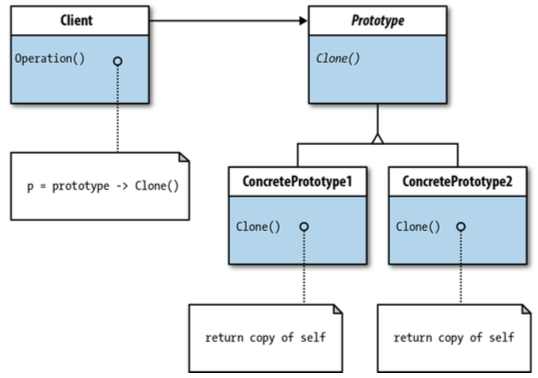
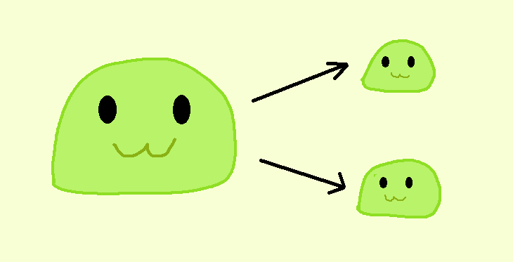

# Prototype

[refactoring.guru](https://refactoring.guru/design-patterns/prototype) | [sourcemaking.com](https://sourcemaking.com/design_patterns/prototype)


Prototype merupakan design pattern yang memanfaatkan _object clonability_ untuk menggandakan object dengan isi dan attribute dengan memastikan object tersebut identik namun tidak terkait satu sama lain.

Dalam bahasa pemrograman Java, class-class/model yang ingin mengimplementasikan Prototype design pattern harus mengimplementasikan interface yang bernama `Cloneable` dimana interface tersebut memiliki method `clone()` yang dapat menggandakan seluruh object attribute beserta isinya.

Cara termudahnya dapat dilakukan dengan permodelan code seperti di bawah:

```java
public class AModel implements Cloneable {
  //attributes & methods

  /**
   * Clone object attributes (including sub-attributes) to new object.
   */
  @Override
  public AModel clone() throws CloneNotSupportedException {
    // as simple by copy their properties using superclass clone()
    return (AModel) super.clone();
  }
}
```

Atau jika kita menginginkan semua object tersalin dengan baik secara _deep copy_ tanpa override method, dengan bantuan Constructor copy di bawah:

```java
public class AModel implements Cloneable {
  //attributes & methods

  /**
   * Use constructor copy without throws CloneNotSupportedException
   */
  @Override
  public AModel clone() {
    // or by copy attributes to constructor copy with set every attribute values below:
    AModel cloned = new AModel("//sets of existing attributes//");
    return cloned;
  }
}
```

Atau gabungan dari keduanya dengan bantuan try-catch untuk mitigasi terhadap masalah cloning pada object tertentu:

```java
public class AModel implements Cloneable {
  //attributes & methods

  /**
   * Use super.clone() + constructor copy mixes using try-catch
   */
  @Override
  public AModel clone() {
    AModel cloned;
    try {
      cloned = (AModel) super.clone();
    } catch (CloneNotSupportedException e) {
      cloned = new AModel("//sets of existing attributes//");
    }
    return cloned;
  }
}
```

Tanpa mengimplementasikan interface `Cloneable`, class akan otomatis melemparkan exception berupa `CloneNotSupportedException` karena adanya satu attribute yang tidak mendukung/mengimplementasikan interface `Cloneable`.

## UML Model



## Contoh implementasi

[Source code](slime) | [Source code - contoh alternatif](ninja)



Misal dalam sebuah game RPG terdapat sebuah monster bernama Slime merupakan monster yang dapat mengembang, mengecil, dan dapat membelah diri. Untuk menciptakan Slime baru dengan ukuran yang lebih besar ataupun lebih kecil, kita dapat menggunakan teknik cloning untuk menyalinkan semua properties dari slime utama ke slime gandaan _(cloned slimes)_ dengan implementasi code di bawah:

```java
public class Slime implements Cloneable {
  private int size;
  private float damage;
  private String color;

  // slime color choices (or predefine it yourself)
  public static final String GREEN_SLIME = "Green";
  public static final String BLUE_SLIME = "Blue";

  // base damage for slime with size of 2
  private static final int BASE_DAMAGE = 10;
  private static final int BASE_SIZE = 2;
  private static final String DEFAULT_SLIME_COLOR = GREEN_SLIME;

  public Slime() {
    this(BASE_SIZE);
  }

  public Slime(int size) {
    this(size, DEFAULT_SLIME_COLOR);
  }

  public Slime(int size, String color) {
    setSize(size);
    this.color = color;
  }

  public void setColor(String color) {
    this.color = color;
  }

  public String getColor() {
    return color;
  }

  public void setSize(int size) {
    this.size = (size < 1) ? 1 : size;
    setDamage(size);
  }

  public int getSize() {
    return size;
  }

  public void setDamage(int size) {
    this.damage = (size * BASE_DAMAGE) / 2;
  }

  public float getDamage() {
    return damage;
  }

  /**
   * The clone() method are used for cloning object. If not supported, use copy constructor as replacement for object cloning.
   * @return cloned object
   */
  @Override
  public Slime clone() {
    try {
        return (Slime) super.clone();
    } catch (CloneNotSupportedException e) {
        return new Slime(size, color);
    }
  }

  public Slime grow() {
    Slime upgraded = clone();
    upgraded.setSize(upgraded.size * 2);
    return upgraded;
  }

  public Slime shrink() {
    Slime shrunk = clone();
    shrunk.setSize(size / 2);
    return shrunk;
  }

  public Slime[] split() throws Exception {
    if (size <= 1) {
      throw new Exception("This slime's size is too small to split!");
    }

    int numOfSplits = getRandomSlimeSplits();
    Slime[] splitSlimes = new Slime[numOfSplits];
    for (int i = 0; i < numOfSplits; i++) {
      splitSlimes[i] = this.shrink();
    }

    return splitSlimes;
  }

  private int getRandomSlimeSplits() {
    int maxSplits = 6;
    int minSplits = 2;
    return (int) Math.round((Math.random() * (maxSplits - minSplits)) + minSplits);
  }

  public String toString() {
      return String.format("Slime (color: %s | size: %d | damage: %.2f HP)", color, size, damage);
  }
}

public class Main {
  public static void main(String[] a) {
    Slime slime = new Slime(5);
    System.out.println("Parent before split: " + slime.toString() + "\n");

    try {
      Slime[] splits = slime.split();
      slime.setSize(3);
      slime.setColor(Slime.BLUE_SLIME);
      System.out.println("Parent after split: " + slime.toString() + "\n");

      System.out.println("Splits:");
      Slime sk = null;
      for (Slime s : splits) {
        System.out.println(s.toString());
        System.out.println((sk != null) ? "Equal to previous clones? " + sk.equals(s) : "First clone instance");
        sk = s;
      }
    } catch (Exception e) {
        System.out.println(e.toString());
    }
  }
}
```


## Permasalahan dalam cloning object

[Source code](ninja)

Perlu diketahui bahwa penerapan method `clone()` ini belum memastikan bahwa object yang ter-clone 100% identik dan tidak terkait satu sama lain _(alias deep copy)_ karena sistem cloning dalam bahasa pemrograman Java masih bersifat **_shallow copy_** karena object-object yang ditunjukkan & dideklarasikan oleh object lain dalam bahasa pemrograman Java adalah referensi memory yang ditujukkan pada object tersebut _[(simak kasus **shallow copy** di Wikipedia)](https://en.wikipedia.org/wiki/Object_copying)_.

Silakan dibaca juga pembahasan Shallow Copy di [Girish Smell: Leaky Encapsulation](https://akmalrusli363.github.io/smell/Girish/Encapsulation#leaky-encapsulation)

Hal itu terbukti dengan pengujian class Ninja dimana seorang Ninja dapat menggandakan diri dan ninja gandaan tersebut dapat menggunakan kemampuan yang berbeda dibanding dengan ninja aslinya, yang pada kasus clone asli (tidak mengimplementasikan deep-copy) terdapat attribute yang masih terhubung satu sama lain.

```java
public class AttackSkill implements Cloneable {
  private String skillName;
  private int skillLevel, baseDamage, stagedDamage;
  private static final float GENERIC_STAGED_DAMAGE_MULTIPLIER = 0.2f;

  public AttackSkill(String skillName, int skillLevel, int baseDamage) {
    this(skillName, skillLevel, baseDamage, GENERIC_STAGED_DAMAGE_MULTIPLIER);
  }

  public AttackSkill(String skillName, int skillLevel, int baseDamage, float damageMultiplier) {
    this(skillName, skillLevel, baseDamage, Math.round(baseDamage * damageMultiplier));
  }

  public AttackSkill(String skillName, int skillLevel, int baseDamage, int stagedDamage) {
    this.skillName = skillName;
    this.skillLevel = skillLevel;
    this.baseDamage = baseDamage;
    this.stagedDamage = stagedDamage;
  }

  private int getMultiplierDamage() {
    return skillLevel * stagedDamage;
  }

  public int applyDamage() {
    return baseDamage + getMultiplierDamage();
  }

  public String getSkillName() {
    return skillName;
  }

  public int getSkillLevel() {
    return skillLevel;
  }

  public void setBaseDamage(int baseDamage) {
    this.baseDamage = baseDamage;
  }

  public int getBaseDamage() {
    return baseDamage;
  }

  public void setStagedDamage(int stagedDamage) {
    this.stagedDamage = stagedDamage;
  }

  public int getStagedDamage() {
    return stagedDamage;
  }

  public void setOverallDamage(int baseDamage) {
    setOverallDamage(baseDamage, GENERIC_STAGED_DAMAGE_MULTIPLIER);
  }

  public void setOverallDamage(int baseDamage, float damageMultiplier) {
    setOverallDamage(baseDamage, Math.round(baseDamage * damageMultiplier));
  }

  public void setOverallDamage(int baseDamage, int stagedDamage) {
    setBaseDamage(baseDamage);
    setStagedDamage(stagedDamage);
  }

  @Override
  public String toString() {
    return String.format("%s (level %d)", getSkillName(), getSkillLevel());
  }
}

public class Ninja implements Cloneable {
  private String name, clan;
  private int level, hp;
  private AttackSkill attackSkill;

  private static final float BASE_HP_MODIFIER = 0.4f;
  private static final int BASE_HP = 1000;

  public Ninja(String name, String clan, AttackSkill attackSkill) {
    this(name, clan, 1, attackSkill);
  }

  public Ninja(String name, String clan, int level, AttackSkill attackSkill) {
    this(name, clan, level, attackSkill, Math.round(BASE_HP * BASE_HP_MODIFIER));
  }

  public Ninja(String name, String clan, int level, AttackSkill attackSkill, int hp) {
    this.name = name;
    this.clan = clan;
    this.level = level;
    this.attackSkill = attackSkill;
    this.hp = hp;
  }

  public int inflictDamage() {
    return Math.round(attackSkill.applyDamage() * (1 + (level * 0.25f)));
  }

  public void receiveDamage(int damage) {
    hp -= (hp - damage < 0) ? 0 : damage;
    System.out.println("Received " + damage + "HP Damage from opponent!");
  }

  public void attack(Ninja enemy) {
    System.out.printf("Giving damage %d HP to enemy...\n", this.inflictDamage());
    enemy.receiveDamage(inflictDamage());
  }

  public void performedJutsuAttack(Ninja enemy) {
    Ninja jutsu = null;
    try {
      jutsu = (Ninja) clone();
    } catch (CloneNotSupportedException ex) {
      // empty catch, to test that cloned object are completely implements Cloneable
    }
    // change ninja name & drop base damage to 20
    jutsu.name = "Juttoro";
    jutsu.attackSkill.setOverallDamage(20);

    int jutsuCloneMultiplier = 2 * Math.round(1 + (level * 0.3f));
    int jutsuDamage = jutsuCloneMultiplier * jutsu.inflictDamage();
    int totalDamage = this.inflictDamage() + jutsuDamage;

    System.out.printf("Giving %s jutsu damage %d HP x %d clones to enemy...\n", jutsu.name, jutsu.inflictDamage(),
        jutsuCloneMultiplier);
    System.out.printf("Giving %s pure damage %d HP to enemy...\n", name, this.inflictDamage());
    enemy.receiveDamage(totalDamage);
  }

  @Override
  public String toString() {
    return String.format("%s (Clan %s) | Level: %d | HP: %d | Skill: %s", name, clan, level, hp,
        attackSkill.toString());
  }
}
```

Pada kasus berikut, ketika Ninja melakukan panggilan `clone()` untuk melakukan panggilan *jutsu*, Ninja tersebut ingin mengubah AttackSkill gandaanya agar damage yang diberikan lebih lemah ketimbang Ninja aslinya namun ketika Ninja asli menyerangnya, Ninja asli tersebut terlalu lemah untuk menyerang lawannya karena ikut diturunkan oleh Ninja gandaanya.

Hal itu juga dibuktikan dengan penggantian nama ninja gandaannya dimana nama ninja asli tidak mengikuti ninja salinannya dengan method implementasi `Cloneable`.

```java
AttackSkill basicAttack = new AttackSkill("Kagira Attack", 2, 160);
AttackSkill kugoAttack = new AttackSkill("Kugo Attack", 8, 110);
Ninja saburo = new Ninja("Uzumaki Saburo", "Uchiha", basicAttack);
Ninja bayu = new Ninja("Uzumaki Bayu", "Pain-Uchiha", kugoAttack);
saburo.attack(bayu);
saburo.performedJutsuAttack(bayu);
```

**Output:**

```
Giving damage 280 HP to enemy...
Received 280HP Damage from opponent!
Giving Juttoro jutsu damage 35 HP x 2 clones to enemy...
Giving Uzumaki Saburo pure damage 35 HP to enemy...
Received 105HP Damage from opponent!
```

Karena damage yang diberikan ninja asli ternyata sama dengan jutsu-nya (alias clone), maka kasus tersebut menimbulkan smell Leaky Encapsulation karena adanya attribute ninja salinan yang saling terkait dengan ninja asli. Bukti tersebut dapat diuji dengan `equals()` dalam method `performedJutsuAttack(Ninja enemy)` di bawah:

```java
System.out.println("Clone equal to original ninja? " + jutsu.equals(this));
System.out.println("Clone's skill equal to original ninja? " + jutsu.attackSkill.equals(this.attackSkill));
```

Output:

```
Clone equal to original ninja? false
Clone's skill equal to original ninja? true
```

Karena sama, maka class `AttackSkill` perlu mengimplementasikan _deep copy_ dalam prototype supaya class tersebut dapat menghasilkan clone tanpa terkait satu sama lain.

Untuk memastikan class tersebut dapat ter-copy secara keseluruhan dan tidak terkait satu sama lain, perlu diketahui bawa teknik **_deep copy_** ini mengharuskan setiap attribute ter-copy secara keseluruhan dengan berbagai cara baik dengan redeklarasi object, penyalinan sub-attribute, serta penggunaan attribute object lama pada attribute object baru.

Ada 2 cara implementasi **_Deep copy_** yaitu:

1. **Override method `clone()`**

   Cara ini sangat mudah untuk dilakukan karena dengan melakukan override method `clone()` dengan syarat telah mengimplementasikan interface `Cloneable` dan menaikkan visibilitas dari `protected` menjadi `public`. Cara ini hanya berlaku bila object yang kita clone tidak mengandung Object lain _(relational object)_ selain wrapper maupun object primitive.

   Contoh (after/AttackSkill.java):

   ```java
   @Override
   public AttackSkill clone() throws CloneNotSupportedException {
     // Tidak disarankan bila terdapat Object lain selain wrapper maupun object primitive.
     return (AttackSkill) super.clone();
   }
   ```

2. **Constructor copy**

   Caranya dengan menyalinkan attribute ke object baru. Pastikan semua object tersalin secara _deep copy_ menggunakan `clone()` pada masing-masing variabel untuk memastikan object tersebut tidak terkait satu sama lain.

   Contoh (after/Ninja.java):

   ```java
   @Override
   public Ninja clone() {
     return new Ninja(name, clan, level, attackSkill.clone(), hp);
   }
   ```

### Implementasi penyelesaian masalah

Dengan menerapkan teknik **_deep copy_** ke dalam prototype, kita

```java
public class AttackSkill implements Cloneable {
  private String skillName;
  private int skillLevel, baseDamage, stagedDamage;
  private static final float GENERIC_STAGED_DAMAGE_MULTIPLIER = 0.2f;

  public AttackSkill(String skillName, int skillLevel, int baseDamage) {
    this(skillName, skillLevel, baseDamage, GENERIC_STAGED_DAMAGE_MULTIPLIER);
  }

  public AttackSkill(String skillName, int skillLevel, int baseDamage, float damageMultiplier) {
    this(skillName, skillLevel, baseDamage, Math.round(baseDamage * damageMultiplier));
  }

  public AttackSkill(String skillName, int skillLevel, int baseDamage, int stagedDamage) {
    this.skillName = skillName;
    this.skillLevel = skillLevel;
    this.baseDamage = baseDamage;
    this.stagedDamage = stagedDamage;
  }

  private int getMultiplierDamage() {
    return skillLevel * stagedDamage;
  }

  public int applyDamage() {
    return baseDamage + getMultiplierDamage();
  }

  public String getSkillName() {
    return skillName;
  }

  public int getSkillLevel() {
    return skillLevel;
  }

  public void setBaseDamage(int baseDamage) {
    this.baseDamage = baseDamage;
  }

  public int getBaseDamage() {
    return baseDamage;
  }

  public void setStagedDamage(int stagedDamage) {
    this.stagedDamage = stagedDamage;
  }

  public int getStagedDamage() {
    return stagedDamage;
  }

  public void setOverallDamage(int baseDamage) {
    setOverallDamage(baseDamage, GENERIC_STAGED_DAMAGE_MULTIPLIER);
  }

  public void setOverallDamage(int baseDamage, float damageMultiplier) {
    setOverallDamage(baseDamage, Math.round(baseDamage * damageMultiplier));
  }

  public void setOverallDamage(int baseDamage, int stagedDamage) {
    setBaseDamage(baseDamage);
    setStagedDamage(stagedDamage);
  }

  @Override
  public String toString() {
    return String.format("%s (level %d)", getSkillName(), getSkillLevel());
  }

  @Override
  protected AttackSkill clone() throws CloneNotSupportedException {
    try {
      return (AttackSkill) super.clone();
    } catch (CloneNotSupportedException ex) {
      return new AttackSkill(skillName, skillLevel, baseDamage, stagedDamage);
    }
  }
}

public class Ninja implements Cloneable {
  private String name, clan;
  private int level, hp;
  private AttackSkill attackSkill;

  private static final float BASE_HP_MODIFIER = 0.4f;
  private static final int BASE_HP = 1000;

  public Ninja(String name, String clan, AttackSkill attackSkill) {
    this(name, clan, 1, attackSkill);
  }

  public Ninja(String name, String clan, int level, AttackSkill attackSkill) {
    this(name, clan, level, attackSkill, Math.round(BASE_HP * BASE_HP_MODIFIER));
  }

  public Ninja(String name, String clan, int level, AttackSkill attackSkill, int hp) {
    this.name = name;
    this.clan = clan;
    this.level = level;
    this.attackSkill = attackSkill;
    this.hp = hp;
  }

  public int inflictDamage() {
    return Math.round(attackSkill.applyDamage() * (1 + (level * 0.25f)));
  }

  public void receiveDamage(int damage) {
    hp -= (hp - damage < 0) ? 0 : damage;
    System.out.println("Received " + damage + "HP Damage from opponent!");
  }

  public void attack(Ninja enemy) {
    System.out.printf("Giving damage %d HP to enemy...\n", this.inflictDamage());
    enemy.receiveDamage(inflictDamage());
  }

  public void performedJutsuAttack(Ninja enemy) {
    Ninja jutsu = null;
    try {
      jutsu = (Ninja) clone();
    } catch (CloneNotSupportedException ex) {
      // empty catch, to test that cloned object are completely implements Cloneable
    }
    // add equality/assertion test (optional) to prove that clone is not equal to original ninja
    System.out.println("Clones equal to original ninja? " + jutsu.equals(this));
    System.out.println("Clone's skill equal to original ninja? " + jutsu.attackSkill.equals(this.attackSkill));

    // change ninja name & drop base damage to 20
    jutsu.name = "Juttoro";
    jutsu.attackSkill.setOverallDamage(20);

    int jutsuCloneMultiplier = 2 * Math.round(1 + (level * 0.3f));
    int jutsuDamage = jutsuCloneMultiplier * jutsu.inflictDamage();
    int totalDamage = this.inflictDamage() + jutsuDamage;

    System.out.printf("Giving %s jutsu damage %d HP x %d clones to enemy...\n", jutsu.name, jutsu.inflictDamage(),
        jutsuCloneMultiplier);
    System.out.printf("Giving %s pure damage %d HP to enemy...\n", name, this.inflictDamage());
    enemy.receiveDamage(totalDamage);
  }

  @Override
  public String toString() {
    return String.format("%s (Clan %s) | Level: %d | HP: %d | Skill: %s", name, clan, level, hp,
        attackSkill.toString());
  }

  @Override
  public Ninja clone() throws CloneNotSupportedException {
    return new Ninja(name, clan, level, attackSkill.clone(), hp);
  }
}
```

Output:

```
Giving damage 280 HP to enemy...
Received 280HP Damage from opponent!
Clones equal to original ninja? false
Clone's skill equal to original ninja? false
Giving Juttoro jutsu damage 35 HP x 2 clones to enemy...
Giving Uzumaki Saburo pure damage 280 HP to enemy...
Received 350HP Damage from opponent!
```

Dengan mengimplementasikan campuran antara `clone()` method overriding dan constructor copy, maka seluruh attribute dari object lama dapat tersalin ke object baru tanpa terkait dengan object lama lagi.


## Catatan

Kita juga bisa mengujicobakan _equality_ dari sebuah object dengan menggunakan method `isDeepCloned()` dengan implementasi code di bawah:

```java
// add all other entity attributes to preserve that the clone is not equals to original instance
private boolean isDeepCloned(Ninja clones) {
  return !(this.equals(clone) || attackSkill.equals(clone.attackSkill));
}
```

Method ini memastikan bahwa seluruh attribute termasuk object itu sendiri berhasil tersalin secara _deep copy_ tanpa terkait dengan object aslinya.

Atau sebaliknya, kita juga bisa menggunakan library **JUnit Tests** untuk menguji apakah object yang terclone dapat tersalin secara _deep copy_ tanpa terkait dengan object aslinya.

## Referensi

- Erich Gamma, Richard Helm, Ralph Johnson, and John Vlissides. Design Patterns: Elements of Reusable Object-Oriented Software. Addison-Wesley Professional, 1994.
- Eric Freeman, Elisabeth Robson, Bert Bates, Kathy Sierra. Head First Design Patterns. O'Reilly Media, 2004. ISBN: 9780596007126.
- Refactoring.guru (Prototype, termasuk referensi gambar) - [https://refactoring.guru/design-patterns/prototype](https://refactoring.guru/design-patterns/prototype)
- SourceMaking (Prototype) - [https://sourcemaking.com/design_patterns/prototype](https://sourcemaking.com/design_patterns/prototype)
- Gang Of Four (GoF) Design Patterns: Prototype - [https://www.journaldev.com/1440/prototype-design-pattern-in-java](https://www.journaldev.com/1440/prototype-design-pattern-in-java)
