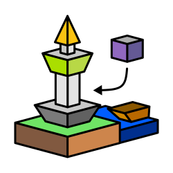
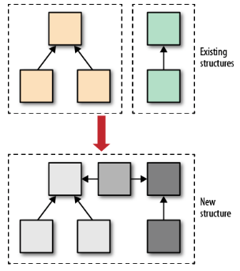
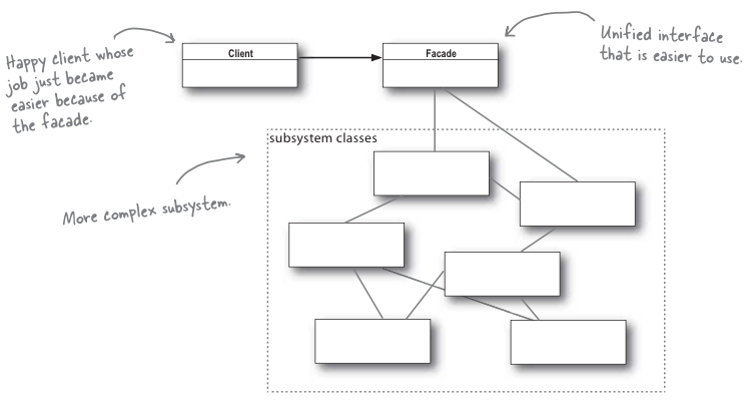
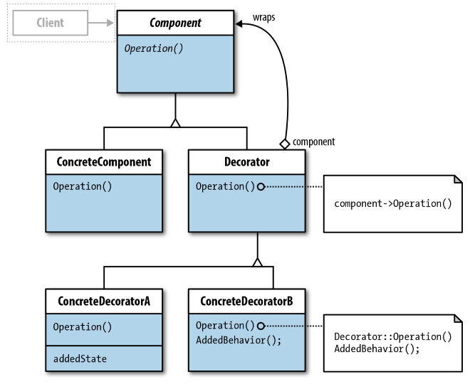
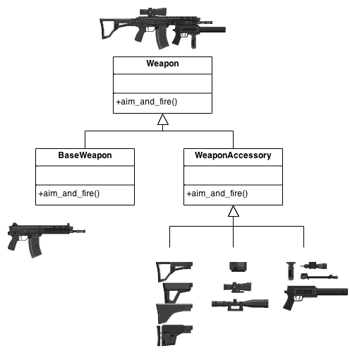
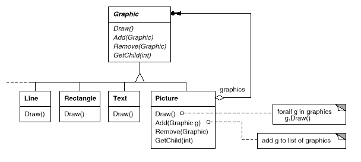

# Structural Patterns

<p align="center" style="text-align:center"></p>

<p align="center" style="text-align:center"></p>

Merupakan design pattern yang berperan dalam strukturisasi object untuk memudahkan skalabilitas _(scalability)_ dengan menjamin fleksibilitas dan efisiensi dari class itu sendiri.

Ada 7 jenis structual patterns:

1. [Adapter](Adapter)
2. [Facade](Facade)
3. [Decorator](Decorator)
4. [Proxy](Proxy)
5. [Bridge](Bridge)
6. [Composite](Composite)
7. Flyweight

## Adapter

[Penjelasan & Source code](adapter) | [refactoring.guru](https://refactoring.guru/design-patterns/adapter) | [sourcemaking.com](https://sourcemaking.com/design_patterns/adapter)

Adapter merupakan design pattern yang menghubungkan antara sebuah class yang dibuat oleh Client dengan class/package/library lain (3rd party) dengan bantuan middle class. Dengan memanfaatkan class penengah, data-data maupun attribute yang digunakan oleh client dapat compatible dengan attribute pada class luaran (3rd party).

Salah satu contoh penerapan adapter adalah adapter antara JSON dan XML dimana kedua jenis object data ini tidak kompatibel secara langsung namun dapat dikomversikan dengan bantuan middle class. Selain itu, ada banyak contoh-contoh lain dimana Client dapat menggunakan design pattern ini untuk mengadaptasi class library terhadap class Client.

### Contoh: Port Adapter

[Source code](smartphone)


Dalam kasus Port adapter, terdapat 2 perangkat smartphone yang RiJukie miliki yaitu iPhone Xy dan Samsung S19. Smartphone iPhone Xy sudah ada sejak 2019 dan Smartphone Samsung S19 baru dibeli beberapa minggu yang lalu. Pada suatu hari, kabel data/charger Samsung S19 dipinjam tetangga sehingga ia hanya mempunyai kabel Lightning yang hanya dapat digunakan di perangkat iPhone saja sehingga harus membeli kabel data untuk HP Samsung yaitu USB-C.

Karena untuk membeli kabel USB-C boleh dikatakan cukup mahal (yaitu sekitar 200-300 ribu), maka cukup sulit bagi kita untuk menabung apalagi mempreteli kabel Lightning hanya demi dapat dipergunakan oleh HP berbasis USB-C seperti Samsung. Sebagai gantinya, kenapa tidak coba beli adapter Lightning to USB-C?

Asumsikan pada kasus mula-mula, didefinisikan 4 class yaitu `Lightning`, `UsbTypeC`, `Samsung`, dan `SamsungCharger`. Keempat class tersebut didefinisikan sebagai berikut:

```java
package ports;
public interface Lightning {
  public void chargeWithLightning();
}

package ports.usbc;
public interface UsbTypeC {
  void chargeWithUsbTypeC();
}

package model.samsung;
public class SamsungCharger {
  private static SamsungCharger instance;

  private SamsungCharger() {
  }

  /**
   * Uses Singleton with thread-safe capability with lazy-loading
   */
  public synchronized static SamsungCharger getInstance() {
    if (instance == null) {
      instance = new SamsungCharger();
    }

    return instance;
  }

  /**
   * Charge using USB-C
   */
  public void charge(UsbTypeC port) {
    port.chargeWithUsbTypeC();
  }
}

public class Samsung {
  private String storage, ram, batteryDuration;
  private final SamsungCharger charger;

  public Samsung() {
    charger = SamsungCharger.getInstance();
  }

  public Samsung(String storage, String ram, String batteryDuration) {
    this();
    this.storage = storage;
    this.ram = ram;
    this.batteryDuration = batteryDuration;
  }

  public String getStorage() {
    return storage;
  }

  public void setStorage(String storage) {
    this.storage = storage;
  }

  public String getRam() {
    return ram;
  }

  public String getBatteryDuration() {
    return batteryDuration;
  }

  public void setBatteryDuration(String batteryDuration) {
    this.batteryDuration = batteryDuration;
  }

  public SamsungCharger getCharger() {
    return charger;
  }

  public void charge(UsbTypeC port) {
    charger.charge(port);
  }

  @Override
  public String toString() {
    return "Samsung [storage=" + storage + ", ram=" + ram + ", batteryDuration=" + batteryDuration + "]";
  }
}
```

Dapat dibayangkan sulitnya dan mustahilnya menggunakan port Lightning dengan HP Samsung S19 dengan port USB-C karena ketidakcocokan port model. Namun dengan menggunakan Adapter design pattern, kita dapat menggunakan `LightningUsbCAdapter` dengan **mengimplementasikan interface `UsbTypeC` dan menggunakan object berbasis interface `Lightning`**.

Dengan asumsi terdapat class adapter port colokan bernama `IPhonePort` dengan implementasi interface `Lightning` dan `SamsungPort` dengan implementasi interface `UsbTypeC`, kita dapat mendeklarasikan class khusus dengan implementasi Adapter design pattern bernama `LightningUsbCAdapter` untuk menghubungkan kedua interface yang berbeda jauh model implementasinya.

Pertama-tama, deklarasikan model colokan yang mengimplementasikan kedua interface colokan tersebut:

```java
package ports;
public class IPhonePort implements Lightning {
  @Override
  public void chargeWithLightning() {
    System.out.println("The phone is charged with Lightning port");
  }
}

package ports.usbc;
public class SamsungPort implements UsbTypeC {
  @Override
  public void chargeWithUsbTypeC() {
    System.out.println("The phone is charged with USB Type C");
  }
}
```

Ketika Client menginginkan adanya koneksi antara Lightning dan USB-C, maka buatlah class `LightningUsbCAdapter` dengan implementasi `UsbTypeC` namun dengan penggunaan object dari `Lightning` seperti pada di bawah:

```java
package ports.usbc;
public class LightningUsbCAdapter implements UsbTypeC {
  private IPhonePort iPort;

  public LightningUsbCAdapter(IPhonePort iPort) {
    this.iPort = iPort;
  }

  @Override
  public void chargeWithUsbTypeC() {
    iPort.chargeWithLightning();
  }
}
```

Kemudian pada sisi pemakainya, misal Client class, cukup lakukan injeksi adapter yang ingin digunakan oleh Client untuk melakukan charging pada perangkat Samsung S19 berbasis USB-C (Misal dengan port bawaan S19 maupun Lightning port dari iPhone Xy dengan bantuan adapter `LightningUsbCAdapter`).

```java
// Asumsikan bahwa Client menggunakan class ini untuk charge Samsung S19
public class Main {
  public Main() {
    Samsung samsungS19 = new Samsung("128GB", "6GB", "4000mAH");
    System.out.println(samsungS19.toString());
    chargeWithUsbTypeC(samsungS19);
    chargeWithLightning(samsungS19);
  }

  private void chargeWithUsbTypeC(Samsung smartphone) {
    SamsungPort samsungPort = new SamsungPort();
    smartphone.charge(samsungPort);
  }

  private void chargeWithLightning(Samsung smartphone) {
    IPhonePort iPhonePort = new IPhonePort();
    LightningUsbCAdapter lightningAdapter = new LightningUsbCAdapter(iPhonePort);
    smartphone.charge(lightningAdapter);
  }

  public static void main(String[] args) {
    new Main();
  }
}
```

Kita juga bisa melakukan hal yang sama pada Adapter USB-C to Lightning port yang dapat dipergunakan pada iPhone apabila kabel Lightningnya dipinjam tetangga, apalagi jika kita pengen beli iPhone XZ yang gak ada kepala colokannya dan kabelnya cuma ada USB-C ke USB-C dari Samsung S19 saja.

```java
package ports.usbc;
public class UsbCLightningAdapter implements Lightning {
  private SamsungPort cPort;

  public UsbCLightningAdapter(SamsungPort cPort) {
    this.cPort = cPort;
  }

  @Override
  public void chargeWithLightning() {
    cPort.chargeWithUsbTypeC();
  }
}
```

Lalu gunakan pada perangkat iPhone kesayangan RiJukie deh :wink:

```java
// Asumsikan bahwa Client menggunakan class ini untuk charge IPhone XZ
public class Main {
  public Main() {
    // sengaja error karena saya tidak masukkan code IPhone ke sini :sad:
    IPhone iPhoneXZ = new IPhone("iPhone XZ Pro Max");
    System.out.println(iPhoneXZ.toString());
    chargeWithUsbTypeC(iPhoneXZ);
    chargeWithLightning(iPhoneXZ);
  }

  private void chargeWithUsbTypeC(IPhone iPhone) {
    SamsungPort samsungPort = new SamsungPort();
    UsbCLightningAdapter usbCAdapter = new UsbCLightningAdapter(iPhonePort);
    iPhone.charge(usbCAdapter);
  }

  private void chargeWithLightning(IPhone iPhone) {
    IPhonePort iPhonePort = new IPhonePort();
    iPhone.charge(iPhonePort);
  }

  public static void main(String[] args) {
    new Main();
  }
}
```

Wah mantap bukan?! Adapter USB-C Lightning pun sudah jadi dan siap dipakai! RiJukie senang melihat kreasi adapter ini :smiley:

Untuk isi code lebih jelasnya dapat kalian lihat pada [source code](smartphone).


## Facade

[Penjelasan & Source code](facade) | [refactoring.guru](https://refactoring.guru/design-patterns/facade) | [sourcemaking.com](https://sourcemaking.com/design_patterns/facade)



Facade adalah design pattern yang mempermudah Client untuk mengakses wilayah-wilayah dalam suatu ruang lingkup API. Facade memungkinkan anda untuk mengendalikan banyak object-object sekaligus dalam 1 genggaman tangan anda.

Dengan Facade, Client tidak perlu mengetahui seluruh isi class dalam library karena Facade-lah yang akan mengendalikan seluruh proses-proses di dalamnya.

Penggunaan Facade sendiri bertujuan untuk mengurangi kompleksitas class-class library terhadap pengguna namun penggunaan Facade sendiri tidak efektif apabila kasus yang dibutuhkan oleh Client benar-benar membutuhkan banyak hal yang Client butuhkan.

### Contoh kasus: Kamar

[Source code](facade/room)

Ketika user dihadapkan dengan banyaknya hal yang perlu mereka lakukan untuk menyiapkan momen-momen penting seperti menyaksikan sepakbola, terkadang kita harus menyiapkan berbagai hal yang barangkali kita tidak inginkan seperti remote TV, channel TV yang ingin kita tonton, jumlah lampu yang dinyalakan, suhu AC, serta menyiapkan barang-barang yang kita inginkan saat itu.

Pemakaian facade ternyata berfungsi untuk mempermudah user dalam melakukan setup ruangan ketika user menginginkan hal-hal yang dibutuhkan oleh user terhadap ruangan (misal nyalakan tv, set channel olahraga, nyalakan AC, dan tutup jendela).

```java
package room;
public class TV {
  private String tvMode = "Television";

  public void powerOn() {
    System.out.println("Turn LED TV on");
    System.out.println("Current TV Mode: " + tvMode);
  }

  public void powerOff() {
    System.out.println("Turn LED TV off");
  }

  public void tvMode() {
    System.out.println("Set TV mode to Television");
    tvMode = "Television";
  }

  public void consoleMode() {
    System.out.println("Set TV mode to Game Console");
    tvMode = "Game Console";
  }

  public void setChannel(String channel) {
    System.out.println("Set TV channel to " + channel);
  }
}

public class AC {
  public void turnOn() {
    System.out.println("Turn AC ON");
  }
  public void turnOff() {
    System.out.println("Turn AC OFF");
  }
  public void cooler() {
    System.out.println("Set AC Cooler");
  }
  public void warmer() {
    System.out.println("Set AC Warmer");
  }
}

public class Lamp {
  public void turnOn() {
    System.out.println("Turn lamps ON");
  }

  public void turnOff() {
    System.out.println("Turn lamps OFF");
  }
}

public class Window {
  public void open() {
    System.out.println("Opening the window");
  }

  public void close() {
    System.out.println("Closing the window");
  }
}

public class Sofa {
  public void clean() {
    System.out.println("Cleaning the sofa");
  }
}
```

Dengan mengimplementasikan Facade, maka kita cukup menggunakan beberapa fitur yang dibutuhkan oleh user untuk keperluan-keperluan tertentu seperti nyalain TV, buka jendela, nyalain AC dalam 1 perintah sekaligus. Code design pattern Facade diimplementasikan sebagai berikut:

```java
package facade;
import room.*;

public class RoomFacader {
  private TV tv;
  private AC ac;
  private Sofa sofa;
  private Lamp lamp;
  private Window window;

  public RoomFacader(TV tv, AC ac, Sofa sofa, Lamp lamp, Window window) {
    this.tv = tv;
    this.ac = ac;
    this.sofa = sofa;
    this.lamp = lamp;
    this.window = window;
  }

  public void sportMode() {
    tv.powerOn();
    tv.tvMode();
    tv.setChannel("Bola TV");
    lamp.turnOn();
    ac.turnOn();
    ac.warmer();
    sofa.clean();
    window.close();
  }

  public void gamingMode() {
    tv.powerOn();
    tv.consoleMode();
    lamp.turnOn();
    ac.turnOn();
    ac.cooler();
    sofa.clean();
    window.close();
  }

  public void leaveRoom() {
    tv.powerOff();
    lamp.turnOff();
    ac.turnOff();
    sofa.clean();
    window.open();
  }
}
```

Ketika user menginginkan momen-momen tertentu tanpa harus kerepotan terhadap barang-barang yang diinteraksikan oleh user, user cukup menjalan perintah dari Facade sebagai berikut:

```java
package main;
import room.*;
import facade.RoomFacader;

public class Main {
  public Main() {
    AC ac = new AC();
    TV tv = new SmartTV();
    Sofa sofa = new Sofa();
    Lamp fan = new Lamp();
    Window window = new Window();

    RoomFacader facade = new RoomFacader(tv, ac, sofa, fan, window);
    facade.sportMode();
    System.out.println();
    facade.gamingMode();
    System.out.println();
    facade.leaveRoom();
  }

  public static void main(String[] args) {
    new Main();
  }
}
```

Dengan demikian, permasalahan terhadap masalah-masalah yang tidak diinginkan oleh user dapat dicegah dan user dapat menghemat waktu untuk mengurus berbagai urusan karena ditangani langsung oleh Facade.


## Decorator

[Penjelasan & Source code](decorator) | [refactoring.guru](https://refactoring.guru/design-patterns/decorator) | [sourcemaking.com](https://sourcemaking.com/design_patterns/decorator)



Merupakan design pattern yang dapat merangkapkan dirinya sendiri dalam model class yang sama, yang berisikan dirinya, dan diakses secara delegatif dari dalam ke luar maupun dari luar ke dalam.

Decorator sangat memungkinkan pengguna untuk merangkap object yang dideklarasikan ke dalam object-object sehierarki dengannya sehingga object tersebut dapat ditambahkan kelengkapan-kelengkapan object dari class lain di dalamnya tanpa harus memodifikasi code dari sebuah object sedikitpun.

### Contoh Kasus: Player, Armor, and Attachment

[Source code](decorator/playerskin) | [Contoh tambahan (Essences of Decorator)](decorator/armory)



> Ilustrasi ini masih berkaitan dengan game battle royale/FPS namun tidak relevan dengan contoh kasus di bawah :smile_cat:

> Ada sekian banyak contoh penerapan Decorator, namun karena berhubung dengan tema materi yang sangat terfokuskan pada game FPS/Battle Royale, maka contoh kasus berikut lebih mencakup pada perlengkapan Player dalam sebuah game berbasis FPS/Battle Royale itu sendiri.

Sebuah game yang dirancang oleh Ananda Studio mengajak player untuk bertarung dengan sistem *Battle Royale* dimana player dapat mengenakan armor dan attachment sekaligus. Untuk mempermudah penambahan aksesoris terhadap sebuah armor, setiap armor dibekali dengan Decorator design pattern yang tentunya mempermudah armor untuk menambah aksesoris sebanyak-banyaknya.

Kita mulai dari Player dimana player dapat mengenakan armor yang ingin ia pakaikan (mulai dari topi, baju, celana, dan sepatu) serta dapat memperlengkap armor dengan aksesoris yang diinginkan oleh player. Kita mulai dari code paling dasar yaitu interface `Player` dan class `BasePlayer` terlebih dahulu.

```java
public interface Player {
  void deploySkin();
}

public class BasePlayer implements Player {
  private String name;
  private int healthPoint, level;

  private static int baseHealthPoint = 100;

  public BasePlayer(String name, int level, int healthPoint) {
    this.name = name;
    this.level = level;
    this.healthPoint = healthPoint;
  }

  public BasePlayer(String name, int level) {
    this(name, level, baseHealthPoint * (level/5));
  }

  public String getName() {
    return name;
  }

  public int getLevel() {
    return level;
  }

  public int getHealthPoint() {
    return healthPoint;
  }

  @Override
  public void deploySkin() {
    System.out.println("Player name : " + name);
    System.out.printf("Player level / HP : Lvl %d (%d HP)\n", level, healthPoint);
    System.out.println("Wear base clothing to player...");
  }
}
```

Kemudian buatlah class decorator `PlayerDecorator` yang diextend dari base class `Player`. Pastikan class tersebut tetap bersifat `abstract` agar tidak dibuatkan langsung sebagai object.

```java
public abstract class PlayerDecorator implements Player {
  protected Player innerSkin; // alias wrapee

  public PlayerDecorator(Player innerSkin) {
    this.innerSkin = innerSkin;
  }
}
```

Setelah decorator abstract class dibuat, tambahkan aksesoris pelengkap player (misal baju, topi, celana, sepatu, termasuk aksesoris pelengkapnya seperti jetpack, sayap, dan backpack).

```java
public class Shirt extends PlayerDecorator {
  private String shirtName;

  public Shirt(Player innerSkin, String shirtName) {
    super(innerSkin);
    this.shirtName = shirtName;
  }

  @Override
  public void deploySkin() {
    innerSkin.deploySkin();
    System.out.println("Wear shirt to player: " + shirtName);
  }
}

public class Hat extends PlayerDecorator {
  private String hatName, hatType;

  public Hat(Player innerSkin, String hatName, String hatType) {
    super(innerSkin);
    this.hatName = hatName;
    this.hatType = hatType;
  }

  @Override
  public void deploySkin() {
    innerSkin.deploySkin();
    System.out.println("Wear " + hatType + " hat to player: " + hatName);
  }
}
```

Ketika user ingin menjalankan/mengeksekusi class yang user buat dan kenakan skin:

```java
Player ucok = new BasePlayer("Ucok", 2000, 99);
ucok = new Shirt(ucok, "Supreme T-Shirt");
ucok = new Hat(ucok, "Topi tentara");
ucok.deploySkin();
```

Maka outputnya adalah sebagai berikut:

```
Player name : Ucok
Player level / HP : Lvl 2000 (99 HP)
Wear base clothing to player...
Wear shirt to player: Supreme T-Shirt
Wear military-type hat to player: Topi tentara
```

## Proxy

[Penjelasan & Source code](proxy) | [refactoring.guru](https://refactoring.guru/design-patterns/proxy) | [sourcemaking.com](https://sourcemaking.com/design_patterns/proxy)


Merupakan design pattern yang diciptakan sebagai class penengah yang bertujuan untuk mengatur akses ke object asli (baik melalui pembatasan, caching, maupun panggilan ke remote class). Sebelum Client dapat benar-benar mengakses object asli, sebuah class harus menghadapi beberapa proses (seperti validasi, akses remote, dll) terlebih dahulu untuk mencegah akses object asli secara langsung.

Design pattern ini sering digunakan dalam kasus koneksi ke database, services, maupun kasus data caching yang sering dipakai dalam aplikasi-aplikasi (baik service maupun app-based) yang memerlukan data secara online.


### Jenis-jenis Proxy

#### 1. Lazy initialization (Virtual Proxy)

Dalam beberapa kasus, terdapat beberapa object yang dapat membebani resource meski jarang dipakai dan dibutuhkan oleh user meski berbarengan dengan pembuatan object class yang baru sekalipun ketika aplikasi tersebut diluncurkan.

Untuk menghemat resources yang digunakan oleh class, Proxy ini dapat membiarkan object tersebut kosong ketika object tersebut dibuat maupun aplikasi tersebut diluncurkan hingga class tersebut dipanggil dan class tersebut akan mengambil data bila diperlukan oleh user sendiri.

Dengan *Lazy-loading*, penggunaan resource dapat dihematkan sehemat mungkin sehingga object cukup dipanggil bila diperlukan oleh user saja.

#### 2. Access control (Protection Proxy)

Pengembangan aplikasi, terutama berbasis web (Web application) dan service memerlukan adanya access control untuk mencegah pihak-pihak yang bukan haknya untuk mengakses laman/fitur/service tertentu.

Untuk membatasi user-user dari pengaksesan data/service tertentu meski bukan tanggungjawabnya, Protection Proxy diberikan untuk mencegah orang-orang yang bukan tanggungjawabnya menyalahgunakan service tersebut.

#### 3. Local execution of a remote service (Remote Proxy)

Apabila Client ingin mengakses Database, diperlukan Remote Proxy yang akan mengetahui kapan data tersebut diambil maupun diproses ke sumber luar (remote sources). Proxy ini juga akan berperan dalam pengaturan akses data secara external (baik HTTP maupun Database).

#### 4. Logging requests (Logging Proxy)

Apabila request tersebut ingin dicatat oleh Client sebagai bukti transaksi request, Proxy dapat dipergunakan dalam pencatatan request dari user kepada server.

#### 5. Caching request results (Caching Proxy)

Apabila hasil request tersebut ingin disimpan oleh Client, Proxy akan menyimpan hasil request tersebut dan akan mengembalikan data yang di-*cached* sebelumnya sebagai bila request tersebut sama dengan apa yang disimpan sebelumnya.

### Contoh Kasus: Accessing the Service

[Source code](proxy/yuutube) | [Contoh tambahan (Essences of Proxy)](proxy/berryservice)


Berangkat dari kasus dasar, misalnya terdapat sebuah aplikasi yang ingin menyalurkan feed-feed video dari YouTube yang ingin disajikan oleh penonton dimana user dapat memilih video yang ingin ia tonton.

Karena akses object asli (pada umumnya) harus menghadapi akses database, maka waktu yang dibutuhkan untuk mendapatkan data tersebut boleh dikatakan cukup lama dan harus dalam keadaan stabil agar dapat diperoleh data yang dibutuhkan. Ketika data asli tersebut sering diakses oleh banyak orang dalam waktu yang bersamaan, maka akan terjadi lambatnya akses pada object/data tersebut.

Sebagai solusinya, kita akan membuat sebuah class yang menjadi proxy, dan memiliki satu attribute yang berisikan class yang akan Client akses. Melalui Proxy, nantinya Client akan berhadapan dengan Proxy dan menjalani operasi verifikasi seperti validasi data untuk kemudian memberikan kuasa pada Proxy untuk mengambil data dari object class asli tersebut sebagai cached data kepada Client.

#### Implementasi Code

Pertama-tama, buatkan model yang berisikan data yang akan diakses oleh Client:

```java
package model;
public class Video {
  private String name;
  private int duration;

  public Video(String name, int duration) {
    this.name = name;
    this.duration = duration;
  }

  public String getName() {
    return name;
  }

  public void setName(String name) {
    this.name = name;
  }

  public int getDuration() {
    return duration;
  }

  public void setDuration(int duration) {
    this.duration = duration;
  }
}
```

Kedua, buat interface bernama `IYoutubeService` yang berisikan method-method untuk mengambil data beserta list berisikan `Video`:

```java
package service;

import java.util.ArrayList;
import model.Video;

public interface IYoutubeService {
  ArrayList<Video> listVideos();
  Video getSpecificVideo(String name);
}
```

Ketiga, buat object real servicenya dan proxy untuk mengambil data yang sudah ada atau mengambil dari real service bila beda dengan permintaan user.

```java
package service;

import java.util.ArrayList;
import model.Video;

public class YoutubeRealService implements IYoutubeService {
  private ArrayList<Video> videos;

  public YoutubeRealService() {
    videos = new ArrayList<>();
    videos.add(new Video("John Wick 3", 103));
    videos.add(new Video("Tom and Jerry", 25));
    videos.add(new Video("Avengers: End Game", 210));
    videos.add(new Video("Goblindo", 45));
    videos.add(new Video("Game of Thrones", 52));
  }

  @Override
  public ArrayList<Video> listVideos() {
    return videos;
  }

  @Override
  public Video getSpecificVideo(String name) {
    for (Video video : videos) {
      if (video.getName().equals(name)) {
        return video;
      }
    }
    return null;
  }
}

public class CachedService implements IYoutubeService {
  private IYoutubeService service;
  private ArrayList<Video> listVideos;
  private Video video;

  /**
   * Load Youtube real service from this proxy
   */
  public CachedService() {
    service = new YoutubeRealService();
  }

  /**
   * Ambil list video dari Youtube real service
   */
  @Override
  public ArrayList<Video> listVideos() {
    if (listVideos == null) {
      listVideos = service.listVideos();
    }
    return listVideos;
  }

  /**
   * Ambil video dari real service bila belum ada video dalam service
   * atau video tersebut berbeda dengan permintaan user
   */
  @Override
  public Video getSpecificVideo(String name) {
    if (video == null || video.getName().equals(name) == false) {
      video = service.getSpecificVideo(name);
    }
    return video;
  }
}
```

Nantinya apabila user ingin mengambil konten yang diinginkan olehnya, Client cukup menggunakan video yang sudah diperoleh dari Service sebelumnya melalui Proxy. Apabila informasi-informasi yang dibutuhkan oleh user ingin diperbarui, Client dapat memanggil Proxy untuk mengambil dari Service secara langsung.


## Bridge

[Penjelasan & Source code](bridge) | [refactoring.guru](https://refactoring.guru/design-patterns/bridge) | [sourcemaking.com](https://sourcemaking.com/design_patterns/bridge)


**Bridge** adalah design pattern yang memisahkan satu kesatuan konsep yang saling bereleasi satu sama lain sebagai 2 hierarki yang terpisah yaitu **abstraksi dan implementasi** dimana abstraksi _(abstraction)_ mempunyai hubungan *has-a* (memiliki attribute) dengan implementasi _(implementor/implementation)_ sehingga menghasilkan hubungan "bridge" antara abstraksi dengan implementasi.

Dalam **Bridge** design pattern, satu kesatuan konsep sebuah komponen dipisahkan hierarkinya menjadi 2 hierarki yaitu **hierarki abstraksi** dan **hierarki interface**.

Bridge bertujuan untuk mengurangi ikatan *coupling* seminimal mungkin sehingga dapat mencegah terjadinya dependensi yang berlebihan (apalagi menghasilkan hierarki yang tidak dibutuhkan)[^1] serta dapat meningkatkan ekspansibilitas pada masing-masing hierarki abstraksi dan implementasi.

")

Karena hierarki antara abstraksi *(abstraction)* dan implementasi *(implementator)* merupakan satu kesatuan konsep hierarki yang terpisah oleh "bridge", maka perubahan maupun penambahan fitur yang melibatkan salah satu sisi hierarki baik abstraksi maupun implementasi dapat lebih mudah ditangani sehingga tidak mempersulit keberadaan komponen secara keseluruhan.


### Contoh Code

## Composite

[Penjelasan & Source code](composite) | [refactoring.guru](https://refactoring.guru/design-patterns/composite) | [sourcemaking.com](https://sourcemaking.com/design_patterns/composite)



Merupakan design pattern dimana komponen-komponen dari sebuah hierarki memiliki hubungan *has-a* ke object lain (mempunyai attribute ke object lain) yang dapat bersifat rekursif. Sebuah hubungan rekursif yang dimiliki sebuah object bisa saja terhubung pada class-class dalam hierarki yang sama yang bersifat kolektif hingga ujung node (alias leaf) yang tidak beranak.

**Composite** sangat memungkinkan sebuah object untuk mempunyai banyak object yang bercabang-cabang di dalamnya sebagai sebuah *tree*.

Secara konseptual, tree mengandung *node leaf* dan *branch* yang berisikan node-node dan branch-branch di dalamnya. Nantinya sebuah composite dapat diakses *(transverse)* melalui *DFS (depth first search)* dan *BFS (breadth first search)*.

Bagi sebagian orang, Composite bisa saja disamakan dengan *Decorator*, namun bedanya ada pada jumlah anak dalam hubungan rekursif yang banyak, namun tidak secara eksplisit mengandung implementasi dari sebuah object yang rekursif di dalamnya.

### Analogi


**Composite** merupakan design pattern yang konsepnya terinspirasi dari *Tree* dimana sebuah tree mengandung *leaf* dan *branch* yang diwakili oleh node-node dalam sebuah *leaf* maupun *branch*. Sebuah *leaf* merupakan node-node yang tidak mempunyai cabang/anak sedangkan *branch* merupakan node yang mempunyai cabang/anak di dalamnya.

Contoh konsep yang mudah dianalogikan pada Composite adalah sistem *folder* dan *file*, dimana sebuah folder *(parent)* dapat berisikan file (*leaf*) dan folder (*parent*) yang bercabang-cabang dan berisikan folder dalam folder hingga folder tersebut hanya berisikan file atau kosong sama sekali.

### Contoh Kasus

[Source code](composite/filesystem)


Salah satu contoh konsep yang paling umum digunakan dalam Operating System adalah File System dimana dalam sebuah storage terdapat banyak file dan folder yang dikumpulkan dalam satu *root directory*. Setiap folder berisikan beberapa file dan folder di dalamnya, juga bisa berupa folder kosong dimana folder tersebut tidak berisikan apapun didalamnya.

Untuk deklarasi dasar, disajikan base class berupa `Component` sebagai berikut:

```java
public abstract class Component {
  protected String name;

  public Component(String name) {
    this.name = name;
  }

  public abstract void open();
  public abstract void rename(String name);

  public final void print() {
    printUsingIndentation(0);
  }

  protected abstract void printUsingIndentation(int indentation);
  protected void printIndent(int n) {
    for(int i = 0; i < n; i++) {
      System.out.print(" ");
    }
  }
}
```

Kemudian pada file dibuatkan sebagai *leaf node* dimana sebuah file hanya berisikan attribute dan behavior dari base class `Component` tanpa adanya hubungan *has-a* dengan object-object sehierarki.

```java
public class File extends Component {
  public File(String name) {
    super(name);
  }

  @Override
  public void open() {
    System.out.println("opening file...");
  }

  @Override
  public void rename(String name) {
    this.name = name;
    System.out.println("renaming file...");
  }

  @Override
  protected void printUsingIndentation(int indentation) {
    printIndent(indentation);
    System.out.println(name);
  }
}
```

Dan folder yang dibuatkan sebagai *branch node* yang berisikan file dan folder yang berbasis dari hierarki yang sama, serta memiliki attribute dan behavior dari base class `Component` dengan tambahan function/method berupa `add(Component)` dan `remove(Component)` untuk menunjang penambahan & pengurangan komponen-komponen yang akan dimasukkan ke dalam *Composite/Container*.

```java
public class Folder extends Component {
  private Vector<Component> components;

  public Folder(String name) {
    super(name);
    components = new Vector<Component>();
  }

  public void add(Component c) {
    components.add(c);
  }

  public void remove(Component c) {
    components.remove(c);
  }

  @Override
  public void open() {
    System.out.println("opening folder...");
  }

  @Override
  public void rename(String name) {
    this.name = name;
    System.out.println("renaming folder...");
  }

  @Override
  protected void printUsingIndentation(int indentation) {
    printIndent(indentation);
    System.out.println(name);

    for(Component c : components) {
      c.printUsingIndentation(indentation + 2);
    }
  }
}
```

Misalkan kita ingin membuat struktur folder sebagai berikut:

- GoF
  - creational
    - prototype.txt
    - singleton.txt
  - structural
    - adapter.txt
    - composite.txt
    - decorator.txt
  - behavioral
    - observer.txt
    - strategy.txt
  - cover.jpg

Maka di client class, kita bisa mendeklarasikan isi-isi dari folder dan file dari struktur folder sebagai berikut:

```java
Folder root = new Folder("GoF");
Folder folder1 = new Folder("creational");
Folder folder2 = new Folder("structural");
Folder folder3 = new Folder("behavioral");

root.add(folder1);
root.add(folder2);
root.add(folder3);

folder1.add(new File("prototype.txt"));
folder1.add(new File("singleton.txt"));

folder2.add(new File("adapter.txt"));
folder2.add(new File("composite.txt"));
folder2.add(new File("decorator.txt"));

folder3.add(new File("observer.txt"));
folder3.add(new File("strategy.txt"));

root.add(new File("cover.jpg"));

root.print();
```

Nantinya ketika user ingin melihat isi struktur dari folder yang ada, cukup panggil `print()` dari folder yang sudah kita buat (misalnya `root`) untuk ditampilkan output file tree sebagai berikut:

```
GoF
  creational
    prototype.txt
    singleton.txt
  structural
    adapter.txt
    composite.txt
    decorator.txt
  behavioral
    observer.txt
    strategy.txt
  cover.jpg
```

## Flyweight

Coming soon...

## Referensi

- Erich Gamma, Richard Helm, Ralph Johnson, and John Vlissides. Design Patterns: Elements of Reusable Object-Oriented Software. Addison-Wesley Professional, 1994.
- Eric Freeman, Elisabeth Robson, Bert Bates, Kathy Sierra. Head First Design Patterns. O'Reilly Media, 2004. ISBN: 9780596007126.
- Refactoring.guru - [https://refactoring.guru/design-patterns/structural-patterns](https://refactoring.guru/design-patterns/creational-patterns)
- Sourcemaking.com - [https://sourcemaking.com/design_patterns/structural_patterns](https://sourcemaking.com/design_patterns/creational_patterns)
- Gang Of Four (GoF) Design Patterns - [https://www.journaldev.com/31902/gangs-of-four-gof-design-patterns](https://www.journaldev.com/31902/gangs-of-four-gof-design-patterns)
