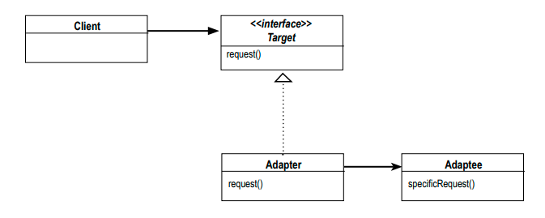
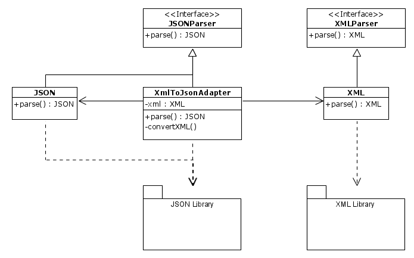
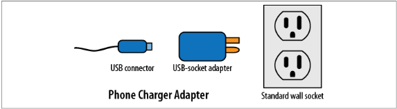
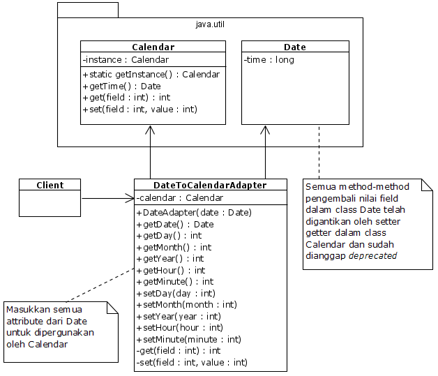

# Adapter

[refactoring.guru](https://refactoring.guru/design-patterns/adapter) | [sourcemaking.com](https://sourcemaking.com/design_patterns/adapter)


> Penjualan smartphone di Indonesia sangatlah subur! Bahkan di tahun 2020, di saat pandemi Corona (COVID-19), ketika seluruh umat manusia menjalankan kegiatannya dari rumah _(meski ada yang harus kerja ke kantor dengan protokol kesehatan)_, smartphone menjadi salah satu benda yang paling berjasa bagi umat manusia di Indonesia dan di seluruh dunia.
>
> Hal itu terbukti dengan fungsionalitas yang paling lengkap dibanding benda-benda lainnya. Tidak hanya sekedar menjadi alat komunikasi, namun juga untuk mengeksplorasi dunia & mengenal ilmu pengetahuan lebih dalam. Smartphone saat ini hadir dengan berbagai tipe colokan charger mulai dari Micro-USB, USB-C, Lightning, Wireless Charging, Magnetic Port, dan terbaru adalah _MagSafe_ untuk iPhone 12.
>
> Apa yang kalian lakukan di rumah bila smartphone yang kalian beli ternyata adalah smartphone pertama kalian dengan USB-C, Lightning, Wireless charging, atau Magnetic port? Kalian semua pasti pusing apalagi jika smartphone yang kalian beli tidak ada kepala colokannya atau kabelnya sama sekali! Cukup merepotkan bukan?
>
> Sebagai gantinya apakah kalian harus menabung beli kabel baru atau beli adapter lalu gunakan dengan kabel yang ada?

Adapter merupakan design pattern yang menghubungkan antara sebuah class yang dibuat oleh Client dengan class/package/library lain (3rd party) dengan bantuan middle class. Dengan memanfaatkan class penengah, data-data maupun attribute yang digunakan oleh client dapat compatible dengan attribute pada class luaran (3rd party).

Salah satu contoh penerapan adapter adalah adapter antara JSON dan XML dimana kedua jenis object data ini tidak kompatibel secara langsung namun dapat dikomversikan dengan bantuan middle class. Selain itu, ada banyak contoh-contoh lain dimana Client dapat menggunakan design pattern ini untuk mengadaptasi class library terhadap class Client.

## UML Model



## Contoh: XML ↔ JSON


Dalam mengadaptasi data antara XML dengan JSON (Web ke mobile, Oracle ke MySQL, maupun pasangan yang berbeda jenisnya), kita perlu mengetahui bahwa dalam mengadaptasi kedua jenis data tersebut tidak memerlukan penulisan ulang data maupun code yang dapat memperlama pengerjaan code dalam sebuah project.

Misal sebuah data dalam XML didefinisikan sebagai berikut:

```xml
<TodoList>
  <LastModified>Rabu, 19 November 2020</LastModified>
  <Contents>
    <Task
      name="Kerjakan tugas Compilation Techniques"
      created="18/11/2020 13:06"
      deadline="1 Minggu"
      done="false" />
    <Task
      name="Servis motor"
      created="12/11/2020 17:46"
      deadline="23/11/2020, 1 hari"
      done="false" />
    <Task
      name="Beli masker kain 3 biji"
      created="04/10/2020 07:22"
      deadline="kapan-kapan"
      done="true" />
  </Contents>
</TodoList>
```

Ketika dalam sebuah kasus sebuah aplikasi dalam project tersebut pada umumnya mendefinisikan pembacaan data dalam bentuk JSON (anggap Data Analytics), maka data-data dalam tipe format lain seperti XML tidak kompatibel dengan permodelan Object Data JSON sehingga harus dilakukan konversi manual dengan menggunakan 2 library yaitu XML Library dan JSON Library.

Sehingga dengan menggunakan Adapter design pattern, maka data hasil konversi XML ke JSON adalah berupa string-string yang diparse dengan bantuan XML & JSON library di bawah: *(Silakan berkhayal dengan bahasa pemrograman kalian masing-masing)*

```json
{
  "todoList": {
    "lastModified": "Rabu, 19 November 2020",
    "contents": {
      "Task": [
        {
          "name": "Kerjakan tugas Compilation Techniques",
          "created": "18/11/2020 13:06",
          "deadline": "1 Minggu",
          "done": false
        },
        {
          "name": "Servis motor</name>",
          "created": "12/11/2020 17:46",
          "deadline": "23/11/2020, 1 hari",
          "done": false
        },
        {
        "name": "Kerjakan tugas Compilation Techniques",
          "created": "18/11/2020 13:06",
          "deadline": "1 Minggu",
          "done": false
        }
      ]
    }
  }
}
```

Terlalu ribet untuk mengimplementasikan code ini? Saya berikan ilustrasi UML untuk mempermudah konversi XML ke JSON di bawah:



Namun karena pada topik ini bukan menyangkut cara menjawab permasalahan tersebut, maka kita simak contoh yang lebih sederhana lagi, yaitu kasus **Port Adapter** dan **Date Adapter**.

## Contoh A: Port Adapter

[Source code](smartphone)



Sesuai dengan judul di atas, kita dapat mengandai-andaikan bahwa kita memiliki 2 smartphone yaitu iPhone Xy dan Samsung S19. Smartphone iPhone Xy sudah ada sejak 2019 dan Smartphone Samsung S19 baru dibeli beberapa minggu yang lalu. Pada suatu hari, ketika charger dan kabel data Samsung (anggap USB-C) sedang digunakan oleh tetangga, kita hanya mempunyai kabel Lightning yang hanya dapat digunakan di perangkat iPhone saja sehingga harus membeli kabel data untuk HP Samsung yaitu USB-C.

Karena untuk membeli kabel USB-C boleh dikatakan cukup mahal (yaitu sekitar 200-300 ribu), maka cukup sulit bagi kita untuk menabung apalagi mempreteli kabel Lightning hanya demi dapat dipergunakan oleh HP berbasis USB-C seperti Samsung. Sebagai gantinya, kenapa tidak coba beli adapter Lightning to USB-C?

Asumsikan pada kasus mula-mula, didefinisikan 4 class yaitu `Lightning`, `UsbTypeC`, `Samsung`, dan `SamsungCharger`. Keempat class tersebut didefinisikan sebagai berikut:

```java
package ports;
public interface Lightning {
  public void chargeWithLightning();
}

package ports.usbc;
public interface UsbTypeC {
  void chargeWithUsbTypeC();
}

package model.samsung;
public class SamsungCharger {
  private static SamsungCharger instance;

  private SamsungCharger() {
  }

  /**
   * Uses Singleton with thread-safe capability with lazy-loading
   */
  public synchronized static SamsungCharger getInstance() {
    if (instance == null) {
      instance = new SamsungCharger();
    }

    return instance;
  }

  /**
   * Charge using USB-C
   */
  public void charge(UsbTypeC port) {
    port.chargeWithUsbTypeC();
  }
}

public class Samsung {
  private String storage, ram, batteryDuration;
  private final SamsungCharger charger;

  public Samsung() {
    charger = SamsungCharger.getInstance();
  }

  public Samsung(String storage, String ram, String batteryDuration) {
    this();
    this.storage = storage;
    this.ram = ram;
    this.batteryDuration = batteryDuration;
  }

  public String getStorage() {
    return storage;
  }

  public void setStorage(String storage) {
    this.storage = storage;
  }

  public String getRam() {
    return ram;
  }

  public String getBatteryDuration() {
    return batteryDuration;
  }

  public void setBatteryDuration(String batteryDuration) {
    this.batteryDuration = batteryDuration;
  }

  public SamsungCharger getCharger() {
    return charger;
  }

  public void charge(UsbTypeC port) {
    charger.charge(port);
  }

  @Override
  public String toString() {
    return "Samsung [storage=" + storage + ", ram=" + ram + ", batteryDuration=" + batteryDuration + "]";
  }
}
```

Dapat dibayangkan sulitnya dan mustahilnya menggunakan port Lightning dengan HP Samsung S19 dengan port USB-C karena ketidakcocokan port model. Namun dengan menggunakan Adapter design pattern, kita dapat menggunakan `LightningUsbCAdapter` dengan **mengimplementasikan interface `UsbTypeC` dan menggunakan object berbasis interface `Lightning`**.

Dengan asumsi terdapat class adapter port colokan bernama `IPhonePort` dengan implementasi interface `Lightning` dan `SamsungPort` dengan implementasi interface `UsbTypeC`, kita dapat mendeklarasikan class khusus dengan implementasi Adapter design pattern bernama `LightningUsbCAdapter` untuk menghubungkan kedua interface yang berbeda jauh model implementasinya.

Pertama-tama, deklarasikan model colokan yang mengimplementasikan kedua interface colokan tersebut:

```java
package ports;
public class IPhonePort implements Lightning {
  @Override
  public void chargeWithLightning() {
    System.out.println("The phone is charged with Lightning port");
  }
}

package ports.usbc;
public class SamsungPort implements UsbTypeC {
  @Override
  public void chargeWithUsbTypeC() {
    System.out.println("The phone is charged with USB Type C");
  }
}
```

Ketika Client menginginkan adanya koneksi antara Lightning dan USB-C, maka buatlah class `LightningUsbCAdapter` dengan implementasi `UsbTypeC` namun dengan penggunaan object dari `Lightning` seperti pada di bawah:

```java
package ports.usbc;
public class LightningUsbCAdapter implements UsbTypeC {
  private IPhonePort iPort;

  public LightningUsbCAdapter(IPhonePort iPort) {
    this.iPort = iPort;
  }

  @Override
  public void chargeWithUsbTypeC() {
    iPort.chargeWithLightning();
  }
}
```

Kemudian pada sisi pemakainya, misal Client class, cukup lakukan injeksi adapter yang ingin digunakan oleh Client untuk melakukan charging pada perangkat Samsung S19 berbasis USB-C (Misal dengan port bawaan S19 maupun Lightning port dari iPhone Xy dengan bantuan adapter `LightningUsbCAdapter`).

```java
// Asumsikan bahwa Client menggunakan class ini untuk charge Samsung S19
public class Main {
  public Main() {
    Samsung samsungS19 = new Samsung("128GB", "6GB", "4000mAH");
    System.out.println(samsungS19.toString());
    chargeWithUsbTypeC(samsungS19);
    chargeWithLightning(samsungS19);
  }

  private void chargeWithUsbTypeC(Samsung smartphone) {
    SamsungPort samsungPort = new SamsungPort();
    smartphone.charge(samsungPort);
  }

  private void chargeWithLightning(Samsung smartphone) {
    IPhonePort iPhonePort = new IPhonePort();
    LightningUsbCAdapter lightningAdapter = new LightningUsbCAdapter(iPhonePort);
    smartphone.charge(lightningAdapter);
  }

  public static void main(String[] args) {
    new Main();
  }
}
```

Kita juga bisa melakukan hal yang sama pada Adapter USB-C to Lightning port yang dapat dipergunakan pada iPhone apabila kabel Lightningnya dipinjam tetangga, apalagi jika kita pengen beli iPhone XZ yang gak ada kepala colokannya dan kabelnya cuma ada USB-C ke USB-C dari Samsung S19 saja.

```java
package ports.usbc;
public class UsbCLightningAdapter implements Lightning {
  private SamsungPort cPort;

  public UsbCLightningAdapter(SamsungPort cPort) {
    this.cPort = cPort;
  }

  @Override
  public void chargeWithLightning() {
    cPort.chargeWithUsbTypeC();
  }
}
```

Lalu gunakan pada perangkat iPhone kesayangan anda deh :wink:

```java
// Asumsikan bahwa Client menggunakan class ini untuk charge IPhone XZ
public class Main {
  public Main() {
    // sengaja error karena saya tidak masukkan code IPhone ke sini :sad:
    IPhone iPhoneXZ = new IPhone("iPhone XZ Pro Max");
    System.out.println(iPhoneXZ.toString());
    chargeWithUsbTypeC(iPhoneXZ);
    chargeWithLightning(iPhoneXZ);
  }

  private void chargeWithUsbTypeC(IPhone iPhone) {
    SamsungPort samsungPort = new SamsungPort();
    UsbCLightningAdapter usbCAdapter = new UsbCLightningAdapter(iPhonePort);
    iPhone.charge(usbCAdapter);
  }

  private void chargeWithLightning(IPhone iPhone) {
    IPhonePort iPhonePort = new IPhonePort();
    iPhone.charge(iPhonePort);
  }

  public static void main(String[] args) {
    new Main();
  }
}
```

Untuk isi code lebih jelasnya dapat kalian lihat pada [source code](smartphone).


## Contoh B: Date to Calendar Adapter

[Source code](date)

Barangkali dalam kasus class `Date` dan `Calendar` dimana beberapa komponen dalam `Date` dianggap _deprecated_ karena sudah digantikan perannya oleh `get()` dalam class `Calendar` dan lebih mudah disesuaikan oleh user.

Ada sekitar 8 method penting yang dianggap _deprecated_ dalam class `Date` dan digantikan perannya oleh setter-getter dalam `Calendar`:

- `setDate()`/`getDate()`
- `setDay()`/`getDay()`
- `setHours()`/`getHours()`
- `setMinutes()`/`getMinutes()`
- `setSeconds()`/`getSeconds()`
- `setMonth()`/`getMonth()`
- `setYear()`/`getYear)`
- `setTimeOffset()`/`getTimeOffset()`

Adapun beberapa method tersebut dianggap deprecated diketahui dalam penjelasan dalam dokumen JDK dijelaskan sebagai berikut:

> Prior to JDK 1.1, the class Date had two additional functions. It allowed the interpretation of dates as year, month, day, hour, minute, and second values. It also allowed the formatting and parsing of date strings. Unfortunately, the API for these functions was not amenable to internationalization. As of JDK 1.1, the Calendar class should be used to convert between dates and time fields and the DateFormat class should be used to format and parse date strings. The corresponding methods in Date are deprecated.

Perlu diketahui bahwa Date dalam Java merupakan implementasi Date/Time dalam Java, namun dengan tingkat presisi hingga miliseconds serta hanya menyimpan data berupa _milisecond epochs_.

Banyaknya fungsi dalam class `Date` yang digantikan oleh class `Calendar` dikaitkan dengan masalah standar waktu internasional dimana dalam beberapa kasus, beberapa method dalam class `Date` sudah tidak relevan dengan kasus-kasus tertentu.

Adapun beberapa method yang menghasilkan nilai yang tidak diinginkan oleh user seperti `getYear()` dimana method tersebut menghasilkan tahun yang dikurangi dengan 1900 padahal user ingin mengeluarkan output tahun Masehi (misal 2020) di bawah:

```java
Date date = new Date();
int year = date.getYear();
// year = 120 bukan 2020 karena date.getYear() = date.year - 1900
System.out.println(year);
```

Karena User/Client tidak boleh lagi menggunakan ke-delapan method tersebut di lain waktu dan tidak relevan dengan perkembangan jaman di Java, maka kita dapat menggunakan adapter Date untuk konversi field Date sebagai object Calendar dan mengembalikan object sebagai Date bila diperlukan oleh Client sebagai berikut:

```java
import java.util.Calendar;
import java.util.Date;

public class DateAdapter {
  private Calendar calendar;

  public DateAdapter(Date date) {
    calendar = Calendar.getInstance();
    calendar.setTime(date);
  }

  public int getDay() {
    return get(Calendar.DATE);
  }
  public void setDay(int day) {
    set(Calendar.DATE, day);
  }

  public int getMonth() {
    return get(Calendar.MONTH);
  }
  public void setMonth(int month) {
    set(Calendar.MONTH, month);
  }

  public int getYear() {
    return get(Calendar.YEAR);
  }
  public void setYear(int year) {
    set(Calendar.YEAR, year);
  }

  public int getHour() {
    return get(Calendar.HOUR);
  }
  public void setHour(int month) {
    set(Calendar.HOUR, month);
  }

  public int getMinute() {
    return get(Calendar.MINUTE);
  }
  public void setMinute(int minute) {
    set(Calendar.MINUTE, minute);
  }

  public Date getDate() {
    return calendar.getTime();
  }

  private int get(int dateField) {
    return calendar.get(dateField);
  }

  private void set(int dateField, int value) {
    calendar.set(dateField, value);
  }
}
```

Atau dalam implementasi model UML:




## Referensi

- Erich Gamma, Richard Helm, Ralph Johnson, and John Vlissides. Design Patterns: Elements of Reusable Object-Oriented Software. Addison-Wesley Professional, 1994.
- Eric Freeman, Elisabeth Robson, Bert Bates, Kathy Sierra. Head First Design Patterns. O'Reilly Media, 2004. ISBN: 9780596007126.
- Refactoring.guru (Adapter, termasuk referensi gambar) - [https://refactoring.guru/design-patterns/adapter](https://refactoring.guru/design-patterns/adapter)
- SourceMaking (Adapter) - [https://sourcemaking.com/design_patterns/adapter](https://sourcemaking.com/design_patterns/adapter)
- Gang Of Four (GoF) Design Patterns: Adapter - [https://www.journaldev.com/1487/adapter-design-pattern-java](https://www.journaldev.com/1487/adapter-design-pattern-java)
- Java SE 8 Documentation: `java.util.Date` - [https://docs.oracle.com/javase/8/docs/api/java/util/Date.html](https://docs.oracle.com/javase/8/docs/api/java/util/Date.html)
