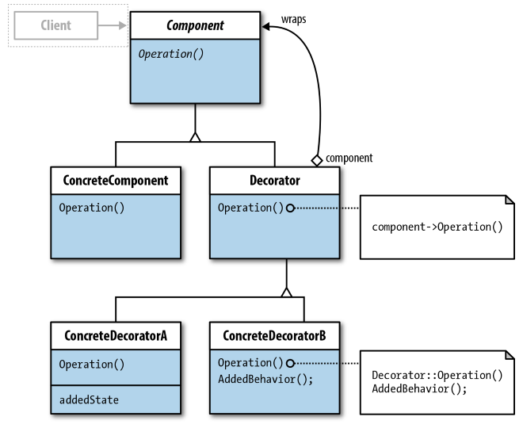
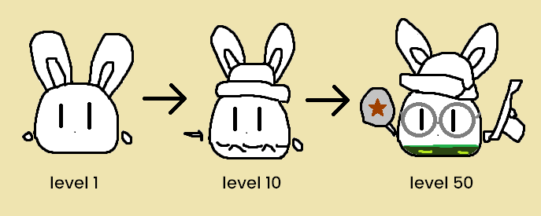
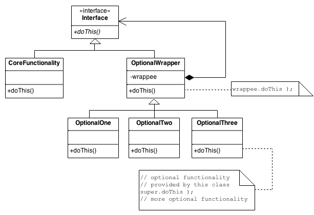
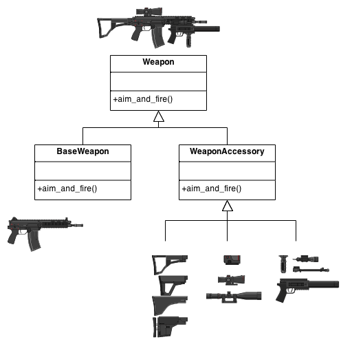

# Decorator

[refactoring.guru](https://refactoring.guru/design-patterns/decorator) | [sourcemaking.com](https://sourcemaking.com/design_patterns/decorator)



Merupakan design pattern yang dapat merangkapkan dirinya sendiri dalam model class yang sama, yang berisikan dirinya, dan diakses secara delegatif dari dalam ke luar maupun dari luar ke dalam.

Decorator sangat memungkinkan pengguna untuk merangkap object yang dideklarasikan ke dalam object-object sehierarki dengannya sehingga object tersebut dapat ditambahkan kelengkapan-kelengkapan object dari class lain di dalamnya tanpa harus memodifikasi code dari sebuah object sedikitpun.


## Analogi



Ada banyak contoh yang dapat dianalogikan dalam kasus Decorator, mulai dari pakaian yang dapat ditebalkan dengan pakaian luar, penambahan perlengkapan senjata, rangkapan dengan compression dan encryption, hingga menambahkan hal-hal yang paralel yang dapat meningkatkan kemampuan dari sebuah object itu sendiri.

Salah satu contoh paling umum dalam Decorator adalah analogi pakaian dimana seseorang pada dasarnya tidak berpakaian sama sekali (alias terlanjang). Untuk mencegah seseorang kedinginan dan malu karena terlanjang, orang-orang mengenakan pakaian untuk menutupi aurat/badan. Dalam kasus tertentu, pakaian dapat ditebalkan untuk meningkatkan penampilan, memperlengkap diri, maupun untuk meningkatkan fungsional secara fisik agar tidak kedinginan.

Selain itu, dalam kasus-kasus tertentu, dalam sebuah game, seorang player dapat mengenakan armor dimana armor dapat ditambahkan dengan sayap, jetpack, maupun backpack untuk memperlengkap seorang player dalam bermain game. Ataupun bagi pemain battle royale (Free Fire dan PUBG), setiap senjata dapat diperlengkap dengan aksesoris maupun skin untuk meningkatkan kemampuan dalam bermain *(misalnya scope, silencer, automator, knife attachment, dan lain-lain)*.


## UML Model




## Essences of Decorator

### 1. Base Class (Component)

Agar Decorator dapat merangkap object lain, diperlukan **base class** untuk mendasari object-object yang sehierarki dengan Decorator. Nantinya semua keperluan-keperluan dari base class sendiri akan dipakai oleh class pemakai (baik class turunan biasa maupun decorator/wrapper).

Contoh code (Armor & Accessoris):

```java
// base class
public interface Armor {
  void attach();
}
```

### 2. Decorator (Wrapper)

**Decorator** (atau sering disebut **Wrapper**) merupakan komponen yang akan merangkapkan komponen dari class-class yang sehierarki sebagai komponen dalaman. Nantinya ketika sebuah object wrapper tersebut dipanggil, maka method dalam Decorator akan memanggil method yang sama pada object dalaman *(wrapee)* dalam wrapper class.

Untuk memanggil method dari inner object, sebuah abstract class yang berisikan komponen dalaman dan diturunkan dari *base class* akan memanggil method yang diimplementasikan pada class-class pemakainya dengan menggunakan method dari object dalaman secara rekursif.

Namun karena class ini bersifat abstract, method yang dipakai dari *base class* baru akan diisikan implementasinya pada class pemakai Decorator dan tidak perlu ditambahkan methodnya (tanpa dioverride dengan cara apapun) pada class `Decorator`.

Contoh code:

```java
// Decorator / Wrapper
public abstract class ArmorDecorator implements Armor {
  protected Armor innerSkin; // alias wrapee
  protected String name;

  public ArmorDecorator(Armor innerSkin, String name) {
    this.innerSkin = innerSkin;
    this.name = name;
  }

  public String getName() {
    return name;
  }
}
```

### 3. Accessoris/Concrete Decorator (to complete decorator)

Untuk memperlengkap Decorator, nantinya akan ada beberapa class-class yang diturunkan dari decorator untuk digunakan sebagai pelengkap komponen. Adapun class-class yang diturunkan dari decorator difungsikan sebagai pelengkap dari komponen-komponen Decorator (termasuk basic component) untuk memanggil method dari komponen dalaman terlebih dahulu sebelum menjalankan method pada class utamanya.

Contoh code:

```java
public class Wings extends ArmorDecorator {
  public Wings(Armor innerSkin, String name) {
    super(innerSkin, name);
  }

  @Override
  public void attach() {
    this.innerSkin.attach();
    System.out.printf("Attaching wing (%s) to your armor...\n", name);
  }
}

public class Jetpack extends ArmorDecorator {
  private int baseCapacity, fuel;
  public Jetpack(Armor innerSkin, String name, int baseCapacity) {
    super(innerSkin, name);
    this.baseCapacity = baseCapacity;
  }

  private void refuel() {
    this.fuel = baseCapacity;
    System.out.printf("Refuel your jetpack...\n");
  }
  
  private void checkFuel() {
    System.out.printf("Current fuel in your jetpack: (%d/%d liter)\n", fuel, baseCapacity);
  }

  @Override
  public void attach() {
    this.innerSkin.attach();
    System.out.printf("Attaching jetpack (%s, %d Liter) to your armor...\n", name, baseCapacity);
    refuel();
    checkFuel();
  }
}
```

### 4. Sets of basic components (if available)

Karena sebuah hierarki decorator dapat mencakup class-class lain selain Decorator, kita juga bisa buat *basic component* untuk mendasari setiap komponen-komponen dari base class, namun tidak dibekali dengan wrapper sehingga object-object tersebut menjadi pilihan dasar bagi pengguna itu sendiri.

Pada kasus armor dan aksesoris, seorang player dapat memilih salah satu dari komponen-komponen penting (misal baju, topi, celana, dan sepatu) sebagai pilihan dasar atas pertahanan dan penampilan dari seorang player itu sendiri.

Untuk membuat *Sets of basic components*, kita dapat membuatkan class baru yang diturunkan/diimplementasikan dari base class dimana nantinya kita cukup melengkapkan semua kebutuhan dari base class yang ada.

Contoh code:

```java
public class Chestplate implements Armor {
  private String name;
  public Chestplate(String name) {
    this.name = name;
  }

  public String getName() {
    return name;
  }

  @Override
  public void attach() {
    System.out.println("Basic chestplate");
  }
}
```

### 5. The power of recursive object call in Decorator

Dalam Decorator, terdapat panggilan method semi-recursive (dengan menggunakan nama method yang sama) pada object yang berada pada satu rumpun hierarki yang sama (misal `PlayerBase` maupun class-class turunan Decorator) melalui method yang digunakan pada base class/interface (misalnya method `attach()` dari interface `Player`).

Contoh kasusnya adalah ketika seorang player ingin menambahkan aksesoris pada baju armor, maka urutan pemanggilan constructor dan method yang diimplementasikan dari base class adalah sebagai berikut:

```java
Armor chestplate = new Chestplate("Iron Chestplate");
Armor wingyChest = new Wings(chestplate, "Elytra");
Armor jettyWingChest = new Jetpack(wingyChest, "Cyberjet", 100);
jettyWingChest.attach();
```

```java
// Bukan code, namun ini adalah urutan eksekusi codenya
Armor chestplate = Chestplate("Iron Chestplate") {
  // set name
}

Armor wingyChest = Wings(chestplate, "Elytra") {
  this.innerSkin = chestplate;
  // set name
}

Armor jettyWingChest = Jetpack(wingyChest, "Cyberjet", 100) {
  this.innerSkin = wingyChest;
  // set name & capacity
}

jettyWingChest.attach() {
  (this.innerSkin as wingyChest).attach() {
    (this.innerSkin as chestplate).attach() {
      System.out.println("Basic chestplate");
    }
    System.out.printf("Attaching wing (%s) to your armor...\n", name);
  }
  System.out.printf("Attaching jetpack (%s, %d Liter) to your armor...\n", name, baseCapacity);
  refuel();
}
```

Maka outputnya dari contoh code tersebut adalah:

```
Basic chestplate
Attaching wing (Elytra) to your armor...
Attaching jetpack (Cyberjet, 100 Liter) to your armor...
Refuel your jetpack...
Current fuel in your jetpack: (100/100 liter)
```


## Contoh Kasus: Player, Armor, and Attachment



> Ilustrasi ini masih berkaitan dengan game battle royale/FPS namun tidak relevan dengan contoh kasus di bawah :smile_cat:

> Ada sekian banyak contoh penerapan Decorator, namun karena berhubung dengan tema materi yang sangat terfokuskan pada game FPS/Battle Royale, maka contoh kasus berikut lebih mencakup pada perlengkapan Player dalam sebuah game berbasis FPS/Battle Royale itu sendiri.

Sebuah game yang dirancang oleh Ananda Studio mengajak player untuk bertarung dengan sistem *Battle Royale* dimana player dapat mengenakan armor dan attachment sekaligus. Untuk mempermudah penambahan aksesoris terhadap sebuah armor, setiap armor dibekali dengan Decorator design pattern yang tentunya mempermudah armor untuk menambah aksesoris sebanyak-banyaknya.

Kita mulai dari Player dimana player dapat mengenakan armor yang ingin ia pakaikan (mulai dari topi, baju, celana, dan sepatu) serta dapat memperlengkap armor dengan aksesoris yang diinginkan oleh player. Kita mulai dari code paling dasar yaitu interface `Player` dan class `BasePlayer` terlebih dahulu.

```java
public interface Player {
  void deploySkin();
}

public class BasePlayer implements Player {
  private String name;
  private int healthPoint, level;

  private static int baseHealthPoint = 100;

  public BasePlayer(String name, int level, int healthPoint) {
    this.name = name;
    this.level = level;
    this.healthPoint = healthPoint;
  }

  public BasePlayer(String name, int level) {
    this(name, level, baseHealthPoint * (level/5));
  }

  public String getName() {
    return name;
  }

  public int getLevel() {
    return level;
  }

  public int getHealthPoint() {
    return healthPoint;
  }

  @Override
  public void deploySkin() {
    System.out.println("Player name : " + name);
    System.out.printf("Player level / HP : Lvl %d (%d HP)\n", level, healthPoint);
    System.out.println("Wear base clothing to player...");
  }
}
```

Kemudian buatlah class decorator `PlayerDecorator` yang diextend dari base class `Player`. Pastikan class tersebut tetap bersifat `abstract` agar tidak dibuatkan langsung sebagai object.

```java
public abstract class PlayerDecorator implements Player {
  protected Player innerSkin; // alias wrapee

  public PlayerDecorator(Player innerSkin) {
    this.innerSkin = innerSkin;
  }
}
```

Setelah decorator abstract class dibuat, tambahkan aksesoris pelengkap player (misal baju, topi, celana, sepatu, termasuk aksesoris pelengkapnya seperti jetpack, sayap, dan backpack).

```java
public class Shirt extends PlayerDecorator {
  private String shirtName;

  public Shirt(Player innerSkin, String shirtName) {
    super(innerSkin);
    this.shirtName = shirtName;
  }

  @Override
  public void deploySkin() {
    innerSkin.deploySkin();
    System.out.println("Wear shirt to player: " + shirtName);
  }
}

public class Hat extends PlayerDecorator {
  private String hatName, hatType;

  public Hat(Player innerSkin, String hatName, String hatType) {
    super(innerSkin);
    this.hatName = hatName;
    this.hatType = hatType;
  }

  @Override
  public void deploySkin() {
    innerSkin.deploySkin();
    System.out.println("Wear " + hatType + " hat to player: " + hatName);
  }
}
```

Ketika user ingin menjalankan/mengeksekusi class yang user buat dan kenakan skin:

```java
Player ucok = new BasePlayer("Ucok", 2000, 99);
ucok = new Shirt(ucok, "Supreme T-Shirt");
ucok = new Hat(ucok, "Topi tentara");
ucok.deploySkin();
```

Maka outputnya adalah sebagai berikut:

```
Player name : Ucok
Player level / HP : Lvl 2000 (99 HP)
Wear base clothing to player...
Wear shirt to player: Supreme T-Shirt
Wear military-type hat to player: Topi tentara
```


## References

- Erich Gamma, Richard Helm, Ralph Johnson, and John Vlissides. Design Patterns: Elements of Reusable Object-Oriented Software. Addison-Wesley Professional, 1994.
- Refactoring.guru (Decorator) - [https://refactoring.guru/design-patterns/decorator](https://refactoring.guru/design-patterns/decorator)
- SourceMaking (Decorator, termasuk referensi gambar) - [https://sourcemaking.com/design_patterns/decorator](https://sourcemaking.com/design_patterns/decorator)
- Gang Of Four (GoF) Design Patterns: Decorator - [https://www.journaldev.com/1540/decorator-design-pattern-in-java-example](https://www.journaldev.com/1540/decorator-design-pattern-in-java-example)