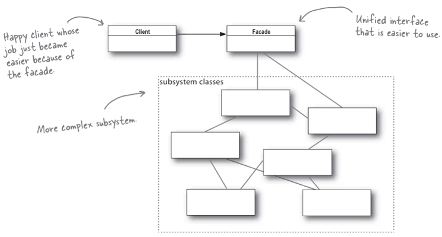

# Facade

[refactoring.guru](https://refactoring.guru/design-patterns/facade) | [sourcemaking.com](https://sourcemaking.com/design_patterns/facade)




> Mau tahu proses pembukaan rekening bank kalian? Misalnya ezeniuzz, terangg, atau teknologi-teknologi fintech lainnya? Atau barangkali mengajukan kredit kepada Kerdilvo untuk belanja online? Saat anda mendaftarkan diri anda ke layanan fintech, anda tentunya diminta nomor KTP anda beserta data-data lengkapnya?
>
> Tentunya hal ini barulah permulaan dan anda tinggal menyerahkan hal itu sepenuhnya kepada Customer Service untuk melakukan aktivasi layanan fintech tersebut melalui berbagai proses yang panjang & kompleks hingga akhirnya proses pengajuan tersebut diterima dan anda menerima notifikasi bahwa proses registrasi/pengajuan anda telah diterima.
>
> Proses-proses yang maha panjang tersebut terbantu dengan adanya **_Facade_** yang tentunya dapat meminimalisir beban yang dihadapi oleh pengguna dengan menyerahkan sepenuhnya pada *"sang jurus selamat"* (contoh: Customer Service)!

Facade adalah design pattern yang mempermudah Client untuk mengakses wilayah-wilayah dalam suatu ruang lingkup API. Facade memungkinkan anda untuk mengendalikan banyak object-object sekaligus dalam 1 genggaman tangan anda.

Dengan Facade, Client tidak perlu mengetahui seluruh isi class dalam library karena Facade-lah yang akan mengendalikan seluruh proses-proses di dalamnya.

Penggunaan Facade sendiri bertujuan untuk mengurangi kompleksitas class-class library terhadap pengguna namun penggunaan Facade sendiri tidak efektif apabila kasus yang dibutuhkan oleh Client benar-benar membutuhkan banyak hal yang Client butuhkan.

## Contoh kasus *Real Life*

[Source code](room)

Ketika user dihadapkan dengan banyaknya hal yang perlu mereka lakukan untuk menyiapkan momen-momen penting seperti menyaksikan sepakbola, terkadang kita harus menyiapkan berbagai hal yang barangkali kita tidak inginkan seperti remote TV, channel TV yang ingin kita tonton, jumlah lampu yang dinyalakan, suhu AC, serta menyiapkan barang-barang yang kita inginkan saat itu.

Pemakaian facade ternyata berfungsi untuk mempermudah user dalam melakukan setup ruangan ketika user menginginkan hal-hal yang dibutuhkan oleh user terhadap ruangan (misal nyalakan tv, set channel olahraga, nyalakan AC, dan tutup jendela).

```java
package room;
public class TV {
  private String tvMode = "Television";

  public void powerOn() {
    System.out.println("Turn LED TV on");
    System.out.println("Current TV Mode: " + tvMode);
  }

  public void powerOff() {
    System.out.println("Turn LED TV off");
  }

  public void tvMode() {
    System.out.println("Set TV mode to Television");
    tvMode = "Television";
  }

  public void consoleMode() {
    System.out.println("Set TV mode to Game Console");
    tvMode = "Game Console";
  }

  public void setChannel(String channel) {
    System.out.println("Set TV channel to " + channel);
  }
}

public class AC {
  public void turnOn() {
    System.out.println("Turn AC ON");
  }
  public void turnOff() {
    System.out.println("Turn AC OFF");
  }
  public void cooler() {
    System.out.println("Set AC Cooler");
  }
  public void warmer() {
    System.out.println("Set AC Warmer");
  }
}

public class Lamp {
  public void turnOn() {
    System.out.println("Turn lamps ON");
  }

  public void turnOff() {
    System.out.println("Turn lamps OFF");
  }
}

public class Window {
  public void open() {
    System.out.println("Opening the window");
  }

  public void close() {
    System.out.println("Closing the window");
  }
}

public class Sofa {
  public void clean() {
    System.out.println("Cleaning the sofa");
  }
}
```

Dengan mengimplementasikan Facade, maka kita cukup menggunakan beberapa fitur yang dibutuhkan oleh user untuk keperluan-keperluan tertentu seperti nyalain TV, buka jendela, nyalain AC dalam 1 perintah sekaligus. Code design pattern Facade diimplementasikan sebagai berikut:

```java
package facade;
import room.*;

public class RoomFacader {
  private TV tv;
  private AC ac;
  private Sofa sofa;
  private Lamp lamp;
  private Window window;

  public RoomFacader(TV tv, AC ac, Sofa sofa, Lamp lamp, Window window) {
    this.tv = tv;
    this.ac = ac;
    this.sofa = sofa;
    this.lamp = lamp;
    this.window = window;
  }

  public void sportMode() {
    tv.powerOn();
    tv.tvMode();
    tv.setChannel("Bola TV");
    lamp.turnOn();
    ac.turnOn();
    ac.warmer();
    sofa.clean();
    window.close();
  }

  public void gamingMode() {
    tv.powerOn();
    tv.consoleMode();
    lamp.turnOn();
    ac.turnOn();
    ac.cooler();
    sofa.clean();
    window.close();
  }

  public void leaveRoom() {
    tv.powerOff();
    lamp.turnOff();
    ac.turnOff();
    sofa.clean();
    window.open();
  }
}
```

Ketika user menginginkan momen-momen tertentu tanpa harus kerepotan terhadap barang-barang yang diinteraksikan oleh user, user cukup menjalan perintah dari Facade sebagai berikut:

```java
package main;
import room.*;
import facade.RoomFacader;

public class Main {
  public Main() {
    AC ac = new AC();
    TV tv = new SmartTV();
    Sofa sofa = new Sofa();
    Lamp fan = new Lamp();
    Window window = new Window();

    RoomFacader facade = new RoomFacader(tv, ac, sofa, fan, window);
    facade.sportMode();
    System.out.println();
    facade.gamingMode();
    System.out.println();
    facade.leaveRoom();
  }

  public static void main(String[] args) {
    new Main();
  }
}
```

Dengan demikian, permasalahan terhadap masalah-masalah yang tidak diinginkan oleh user dapat dicegah dan user dapat menghemat waktu untuk mengurus berbagai urusan karena ditangani langsung oleh Facade.


## Kekurangan/Bahaya Facade

Facade bukanlah solusi yang baik bagi pengguna/Client apalagi Client memerlukan banyak hal yang perlu dilakukan dengan interaksi langsung dengan class termaksud (Misalnya Client ingin memilih opsi custom order dimana Client ingin menghilangkan tahap-tahapan tertentu yang dipesan oleh Client itu sendiri).

Selain itu, Facade juga berpotensi menciptakan God Class karena membengkaknya kebutuhan class yang diperlukan bagi Client untuk meminimalisir kompleksitas secara langsung terhadap user.


## Referensi

- Erich Gamma, Richard Helm, Ralph Johnson, and John Vlissides. Design Patterns: Elements of Reusable Object-Oriented Software. Addison-Wesley Professional, 1994.
- Eric Freeman, Elisabeth Robson, Bert Bates, Kathy Sierra. Head First Design Patterns. O'Reilly Media, 2004. ISBN: 9780596007126.
- Refactoring.guru (Facade) - [https://refactoring.guru/design-patterns/facade](https://refactoring.guru/design-patterns/facade)
- SourceMaking (Facade, termasuk referensi gambar) - [https://sourcemaking.com/design_patterns/facade](https://sourcemaking.com/design_patterns/facade)
- Gang Of Four (GoF) Design Patterns: Adapter - [https://www.journaldev.com/1557/facade-design-pattern-in-java](https://www.journaldev.com/1557/facade-design-pattern-in-java)
