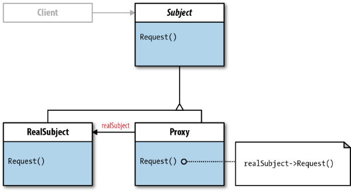
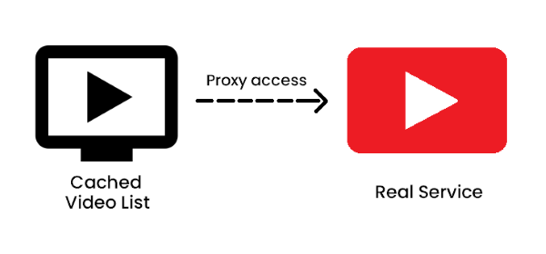

# Proxy

[refactoring.guru](https://refactoring.guru/design-patterns/proxy) | [sourcemaking.com](https://sourcemaking.com/design_patterns/proxy)



Merupakan design pattern yang diciptakan sebagai class penengah yang bertujuan untuk mengatur akses ke object asli (baik melalui pembatasan, caching, maupun panggilan ke remote class). Sebelum Client dapat benar-benar mengakses object asli, sebuah class harus menghadapi beberapa proses (seperti validasi, akses remote, dll) terlebih dahulu untuk mencegah akses object asli secara langsung.

Design pattern ini sering digunakan dalam kasus koneksi ke database, services, maupun kasus data caching yang sering dipakai dalam aplikasi-aplikasi (baik service maupun app-based) yang memerlukan data secara online.


## Jenis-jenis Proxy

### 1. Lazy initialization (Virtual Proxy)

Dalam beberapa kasus, terdapat beberapa object yang dapat membebani resource meski jarang dipakai dan dibutuhkan oleh user meski berbarengan dengan pembuatan object class yang baru sekalipun ketika aplikasi tersebut diluncurkan.

Untuk menghemat resources yang digunakan oleh class, Proxy ini dapat membiarkan object tersebut kosong ketika object tersebut dibuat maupun aplikasi tersebut diluncurkan hingga class tersebut dipanggil dan class tersebut akan mengambil data bila diperlukan oleh user sendiri.

Dengan *Lazy-loading*, penggunaan resource dapat dihematkan sehemat mungkin sehingga object cukup dipanggil bila diperlukan oleh user saja.

### 2. Access control (Protection Proxy)

Pengembangan aplikasi, terutama berbasis web (Web application) dan service memerlukan adanya access control untuk mencegah pihak-pihak yang bukan haknya untuk mengakses laman/fitur/service tertentu.

Untuk membatasi user-user dari pengaksesan data/service tertentu meski bukan tanggungjawabnya, Protection Proxy diberikan untuk mencegah orang-orang yang bukan tanggungjawabnya menyalahgunakan service tersebut.

### 3. Local execution of a remote service (Remote Proxy)

Apabila Client ingin mengakses Database, diperlukan Remote Proxy yang akan mengetahui kapan data tersebut diambil maupun diproses ke sumber luar (remote sources). Proxy ini juga akan berperan dalam pengaturan akses data secara external (baik HTTP maupun Database).

### 4. Logging requests (Logging Proxy)

Apabila request tersebut ingin dicatat oleh Client sebagai bukti transaksi request, Proxy dapat dipergunakan dalam pencatatan request dari user kepada server.

### 5. Caching request results (Caching Proxy)

Apabila hasil request tersebut ingin disimpan oleh Client, Proxy akan menyimpan hasil request tersebut dan akan mengembalikan data yang di-*cached* sebelumnya sebagai bila request tersebut sama dengan apa yang disimpan sebelumnya.


## Essences of Proxy

### 1. Service Interface

Karena Proxy membutuhkan interface sebagai penghubung antara Real Service dan Proxy Service, kita memerlukan 1 interface yang berisikan method-method yang akan digunakan pada kedua classnya.

Anggap interface tersebut berisikan komponen untuk registrasi dan pengambilan data:

```java
public interface IBerryService {
  void placeOrder(Product product, int quantity);
  ArrayList<Order> getAllOrders();
  Order getOrderByID(int id);
}
```

### 2. Real Service

Untuk mengambil data, kita memerlukan real object untuk dijadikan referensi dalam penggunaan Proxy, terutama bila Client ingin mengambil data secara remote, mengambil data yang perlu, maupun ingin mengakses data-data yang terbatas oleh User Role tertentu.

Untuk membuat real service sendiri, buatlah class dengan implementasi dari Service Interface yang sudah kita buat sebelumnya *(misalnya `IBerryService`)* dan cantumkan semua komponen yang akan diakses secara (tidak) langsung ke user.

```java
public class RealBerryService {
  private DBConnector connector;
  private ArrayList<Order> orderList;

  public RealBerryService() {
    connector = new DBConnector();
  }

  public void placeOrder(Product product, int quantity) {
    Order order = new Order(product, quantity);
    // place to Database
  }

  public ArrayList<Order> getAllOrders() {
    orderList = fetchAllOrdersFromDatabase();
    return orderList;
  }

  public Order getOrderByID(int id) {
    for (Order order : orderList) {
      if (order.getOrderId() == id) {
        return order;
      }
    } return null;
  }

  private ArrayList<Order> fetchAllOrdersFromDatabase() {
    orderList = new ArrayList<Order>();
    // fetch from Database and apply it to orderList
    return orderList;
  }
}
```

### 3. Proxy "Service"

Sebagai mitigasi terhadap sebuah real service, Proxy berperan dalam menjalankan proses tambahan baik sebelum/sesudah menghadapi Real Service (baik lazy loading, validasi data, mengambil data yang telah dicached, logging, maupun membatasi akses yang diberikan oleh user).

Dalam sebuah Proxy class, terdapat 1 Object yang terhubung dengan Real Service dan semua method-method implementasi dari sebuah Service Interface harus terhubung dengan Real Service yang akan menjalankan operasi tersebut.

Untuk membuat proxy, buatlah class dengan implementasi dari Service Interface yang sudah kita buat sebelumnya *(misalnya `IBerryService`)* dan cantumkan semua komponen dan tambahkan proses-proses yang harus dihadapi Client sebelum dapat mengakses real service (seperti validasi, logging, maupun caching).

```java
public class ProxyBerryService {
  private Order order;
  private ArrayList<Order> orderList;
  private RealBerryService service;

  /**
   * Declare Proxy dengan inisialisasi Real Service
   */
  public ProxyBerryService() {
    service = new RealBerryService();
  }

  /**
   * Validasikan order yang akan diinput sebelum masuk ke service
   */
  public void placeOrder(Product product, int quantity) {
    if (product != null && quantity > 0) {
      service.placeOrder(product, quantity);
    }
  }

  /**
   * Ambil semua order bila belum di-cache atau gunakan order yang ada
   */
  public ArrayList<Order> getAllOrders() {
    if (orderList == null) {
      orderList = service.getAllOrders();
    }
    return orderList;
  }

  /**
   * Overload method untuk memperbolehkan Client untuk mengambil
   * data paling baru dari server
   */
  public ArrayList<Order> getAllOrders(boolean force) {
    orderList = force ? service.getAllOrders() : getAllOrders();
    return orderList;
  }

  /**
   * Validasikan order yang akan diinput sebelum masuk ke service
   */
  public Order getOrderByID(int id) {
    if (order == null || order.getOrderId() != id) {
      order = service.getOrderByID(id);
    }
    return order;
  }
}
```

Kamu juga bisa menambahkan sebanyak mungkin method dan attribute dalam class tersebut dengan memastikan bahwa Proxy class tersebut dapat mendukung aksesbilitas user dalam mengakses Service (termasuk cakupan logging dan caching).


## Contoh Kasus: Accessing the Service



Berangkat dari kasus dasar, misalnya terdapat sebuah aplikasi yang ingin menyalurkan feed-feed video dari YouTube yang ingin disajikan oleh penonton dimana user dapat memilih video yang ingin ia tonton.

Karena akses object asli (pada umumnya) harus menghadapi akses database, maka waktu yang dibutuhkan untuk mendapatkan data tersebut boleh dikatakan cukup lama dan harus dalam keadaan stabil agar dapat diperoleh data yang dibutuhkan. Ketika data asli tersebut sering diakses oleh banyak orang dalam waktu yang bersamaan, maka akan terjadi lambatnya akses pada object/data tersebut.

Sebagai solusinya, kita akan membuat sebuah class yang menjadi proxy, dan memiliki satu attribute yang berisikan class yang akan Client akses. Melalui Proxy, nantinya Client akan berhadapan dengan Proxy dan menjalani operasi verifikasi seperti validasi data untuk kemudian memberikan kuasa pada Proxy untuk mengambil data dari object class asli tersebut sebagai cached data kepada Client.

### Implementasi Code

Pertama-tama, buatkan model yang berisikan data yang akan diakses oleh Client:

```java
package model;
public class Video {
  private String name;
  private int duration;
  
  public Video(String name, int duration) {
    this.name = name;
    this.duration = duration;
  }

  public String getName() {
    return name;
  }
  
  public void setName(String name) {
    this.name = name;
  }
  
  public int getDuration() {
    return duration;
  }
  
  public void setDuration(int duration) {
    this.duration = duration;
  }
}
```

Kedua, buat interface bernama `IYoutubeService` yang berisikan method-method untuk mengambil data beserta list berisikan `Video`:

```java
package service;

import java.util.ArrayList;
import model.Video;

public interface IYoutubeService {
  ArrayList<Video> listVideos();
  Video getSpecificVideo(String name);
}
```

Ketiga, buat object real servicenya dan proxy untuk mengambil data yang sudah ada atau mengambil dari real service bila beda dengan permintaan user.

```java
package service;

import java.util.ArrayList;
import model.Video;

public class YoutubeRealService implements IYoutubeService {
  private ArrayList<Video> videos;

  public YoutubeRealService() {
    videos = new ArrayList<>();
    videos.add(new Video("John Wick 3", 103));
    videos.add(new Video("Tom and Jerry", 25));
    videos.add(new Video("Avengers: End Game", 210));
    videos.add(new Video("Goblindo", 45));
    videos.add(new Video("Game of Thrones", 52));
  }

  @Override
  public ArrayList<Video> listVideos() {
    return videos;
  }

  @Override
  public Video getSpecificVideo(String name) {
    for (Video video : videos) {
      if (video.getName().equals(name)) {
        return video;
      }
    }
    return null;
  }
}

public class CachedService implements IYoutubeService {
  private IYoutubeService service;
  private ArrayList<Video> listVideos;
  private Video video;

  /**
   * Load Youtube real service from this proxy
   */
  public CachedService() {
    service = new YoutubeRealService();
  }

  /**
   * Ambil list video dari Youtube real service
   */
  @Override
  public ArrayList<Video> listVideos() {
    if (listVideos == null) {
      listVideos = service.listVideos();
    }
    return listVideos;
  }

  /**
   * Ambil video dari real service bila belum ada video dalam service 
   * atau video tersebut berbeda dengan permintaan user
   */
  @Override
  public Video getSpecificVideo(String name) {
    if (video == null || video.getName().equals(name) == false) {
      video = service.getSpecificVideo(name);
    }
    return video;
  }
}
```

Nantinya apabila user ingin mengambil konten yang diinginkan olehnya, Client cukup menggunakan video yang sudah diperoleh dari Service sebelumnya melalui Proxy. Apabila informasi-informasi yang dibutuhkan oleh user ingin diperbarui, Client dapat memanggil Proxy untuk mengambil dari Service secara langsung.


## Referensi

- Erich Gamma, Richard Helm, Ralph Johnson, and John Vlissides. Design Patterns: Elements of Reusable Object-Oriented Software. Addison-Wesley Professional, 1994.
- Eric Freeman, Elisabeth Robson, Bert Bates, Kathy Sierra. Head First Design Patterns. O'Reilly Media, 2004. ISBN: 9780596007126.
- Refactoring.guru (Proxy) - [https://refactoring.guru/design-patterns/proxy](https://refactoring.guru/design-patterns/proxy)
- SourceMaking (Proxy) - [https://sourcemaking.com/design_patterns/proxy](https://sourcemaking.com/design_patterns/proxy)
- Gang Of Four (GoF) Design Patterns: Proxy - [https://www.journaldev.com/1572/proxy-design-pattern](https://www.journaldev.com/1572/proxy-design-pattern)
- Wikipedia English: Proxy Pattern - [https://en.wikipedia.org/wiki/Proxy_pattern](https://en.wikipedia.org/wiki/Proxy_pattern)
